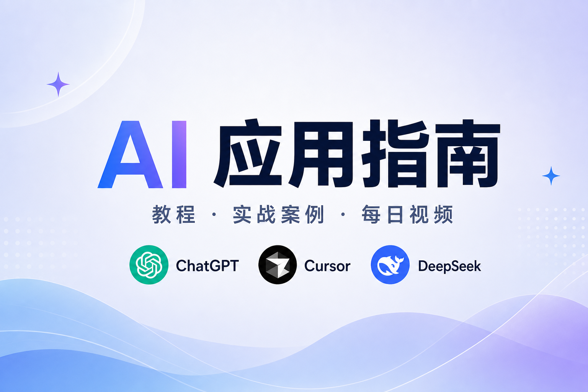

# Bio AI Lab

**AI 学习与工具导航平台** — 国内国际热门 AI 工具分类、排行对比、开源精选与每周资讯。

Discover, learn, and create with AI — covering ChatGPT, Claude, Gemini, DeepSeek, Kimi, Cursor, Copilot, and more.

**Website:** https://bio-apple.github.io/ai/

[](https://bio-apple.github.io/ai/)
[](./DEVELOPER.md)
[](https://github.com/bio-apple/ai)

## Screenshot

| 首页 Hero | 工具卡片 | 学习流程 |
|-----------|----------|----------|
|  | 国内/国际热门工具 + 排行对比 | [AI 学习路线](https://bio-apple.github.io/ai/ai-learning-roadmap.html) |

> 线上预览：[https://bio-apple.github.io/ai/](https://bio-apple.github.io/ai/)

## Features

| 功能 | 支持 |
|------|------|
| 国内/国际 AI 工具导航与分类 | ✅ |
| 工具排行榜与选型对比表 | ✅ |
| 使用教程与实战案例 | ✅ |
| AI 学习路线与选择助手 | ✅ |
| GitHub Stars 开源精选（6 大领域） | ✅ |
| 每周 AI 新闻（官方 RSS + arXiv + Trending） | ✅ |
| Prompt 提示词库 | ✅ |
| AI 创作工具区 | ✅ |
| 每日六类视频推荐（YouTube + B站） | ✅ |
| 站内搜索（Fuse.js）+ 知识库问答 | ✅ |
| Astro SSG 构建 + GitHub Pages 自动部署 | ✅ |

## 涵盖工具

| 类型 | 工具 |
|------|------|
| 国际对话 AI | ChatGPT、Claude、Gemini |
| 国内对话 AI | Kimi、通义千问、豆包、DeepSeek |
| 编程与开发 AI | Cursor、Codex、Copilot |

## 内容模块

### 1. AI 视频（每日更新）

北京时间每日 0:00 自动抓取，分 **六类推荐**：

| 平台 | 分类 | 数量 |
|------|------|------|
| YouTube | 全网播放量 Top | 10 |
| YouTube | 30 天内上新 | 5 |
| YouTube | 24h 上新 | 3 |
| B站 | 全网播放量 Top | 10 |
| B站 | 30 天内上新 | 5 |
| B站 | 24h 上新 | 3 |

### 2. 工具、分类、排行与比较

- 首页：国际/国内/编程三大类工具卡片
- 2026 AI 工具排行榜 + 首页对比表预览
- 独立对比专题页（Cursor vs Copilot、ChatGPT vs DeepSeek 等）

### 3. GitHub Stars 开源精选（每周刷新 Star）

六大应用领域，每领域至少 1 个代表项目：

| 领域 | 代表项目 |
|------|----------|
| AI Agent | LangGraph、crewAI |
| LLM 应用开发 | Dify、LlamaIndex |
| 本地大模型 | Ollama、llama.cpp |
| AI 绘画 | ComfyUI、Stable Diffusion WebUI |
| 多模态 | LLaVA、Transformers |
| 机器学习框架 | PyTorch、JAX |

### 4. AI 新闻（每周更新）

北京时间每周一 6:00 自动汇总：

- **公司动态**：OpenAI、Anthropic、Google DeepMind、Google AI、NVIDIA、Microsoft（RSS / 官网抓取）
- **中文媒体**：智源社区聚合（新智元、量子位）、量子位 RSS
- **关注面板**：Meta AI、Hugging Face、机器之心（博客 + X，暂无稳定 RSS）
- **技术源**：GitHub Trending、arXiv（cs.AI / cs.LG / cs.CL / cs.CV）

## 页面结构

```
首页（SPA 多 Tab）
├── Hero 首屏 + 站内搜索
├── 热门 AI 工具（国内/国际分类）
├── AI 能力分类
├── AI 工具排行榜
├── AI 工具选型对比表
├── AI 学习路线
├── GitHub Stars 开源精选
├── 本周 AI 热点
├── AI 选择助手
├── 精选教程与视频
├── AI 创作 / 教程 / Prompt库
├── 开源精选（完整列表）
├── AI 新闻 + 持续关注源
└── 每日六类视频推荐

独立 SEO 页
├── /tools/{tool}.html        （10 个工具，自动生成）
├── /ai-tools-ranking.html
├── /ai-learning-roadmap.html
├── /guides/beginner.html
├── /guides/advanced.html
├── /news/daily-ai-news.html
├── /prompts/library.html
├── /cases/index.html
└── /compare/*.html
```

## 快速开始

### 本地预览

```bash
cd ai
npm ci
pip install -r requirements.txt
./build.sh          # Astro SSG → dist/
./start.sh          # FastAPI 预览 dist/
```

访问 http://127.0.0.1:8765

### 手动刷新动态数据

```bash
pip install yt-dlp pyyaml
python scripts/fetch_daily_videos.py   # 每日视频
python scripts/fetch_ai_news.py        # 每周新闻
python scripts/fetch_oss_stars.py      # 开源 Star 数
```

**开发者文档**：[DEVELOPER.md](./DEVELOPER.md)（架构、数据格式、CI/CD、故障排查）

## 自动更新

| 内容 | 时间（北京时间） | 工作流 |
|------|------------------|--------|
| AI 视频（六类） | 每日 00:00 | `daily-videos.yml` |
| AI 新闻 + 开源 Star | 每周一 06:00 | `weekly-news.yml` |

推送 `main` 后，GitHub Actions 自动构建 `dist/` 并部署到 GitHub Pages。

## 技术栈

| 层级 | 技术 |
|------|------|
| 构建 | Astro 5 SSG |
| 内容 | `data/*.json` |
| 样式/交互 | 原生 CSS + JavaScript |
| 搜索 | Fuse.js + `search-index.json` |
| 动态数据 | `daily-videos.json` · `ai-news.json` · `oss-projects.json` |
| 部署 | GitHub Pages + GitHub Actions |

## Roadmap

| 阶段 | 内容 | 状态 |
|------|------|------|
| Phase 1 | 首页重构、新导航、工具卡片、UI 升级 | ✅ 已完成 |
| Phase 2 | 排行榜、选择助手、新闻、创作区、指南页 | ✅ 已完成 |
| Phase 2.5 | Prompt 库、案例库、视频筛选、JSON 导出 | ✅ 已完成 |
| Phase 3 | Astro SSG、六类视频、开源精选、每周新闻扩展信源 | ✅ 已完成 |
| Phase 3.5 | 智源社区聚合、新闻信源多样性、CI 六类校验与 E2E | ✅ 已完成 |
| Phase 4 | 用户收藏、搜索增强 | 🔜 规划中 |

## License

MIT — see [GitHub repository](https://github.com/bio-apple/ai).
