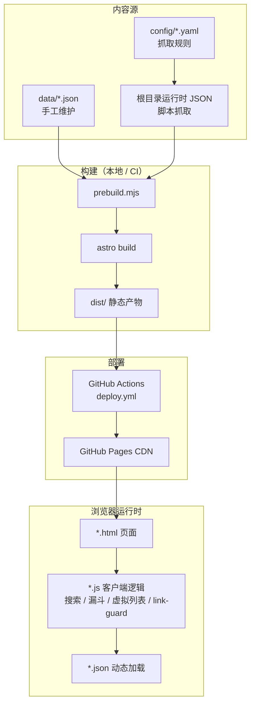
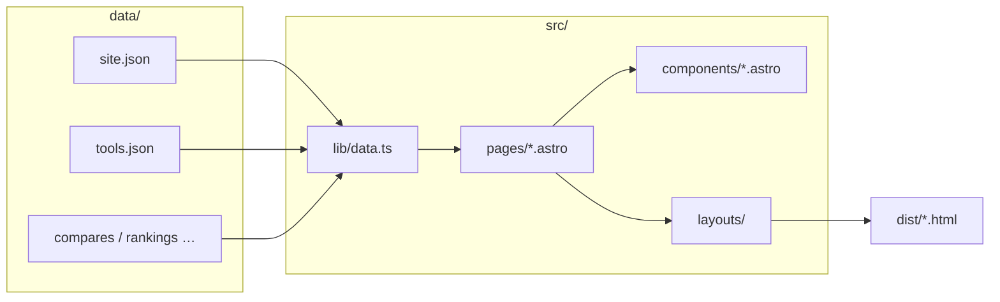
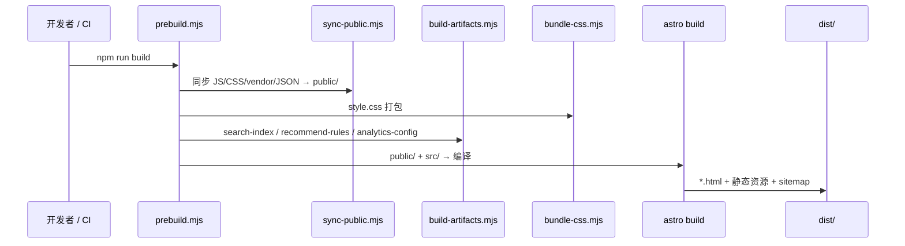
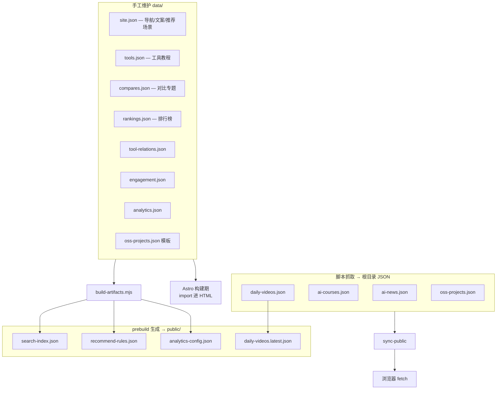
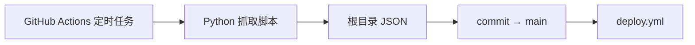
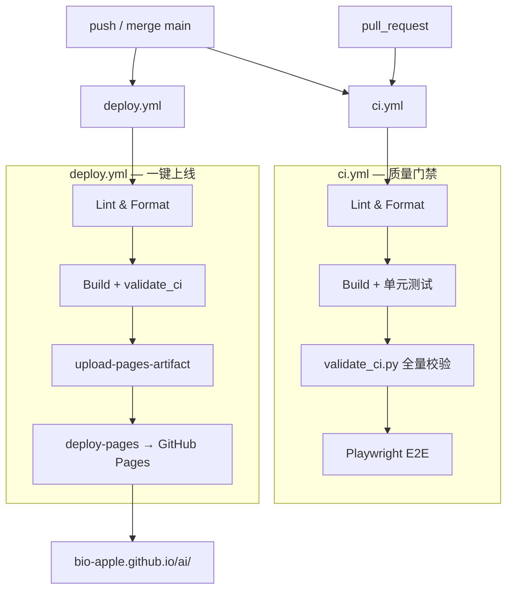
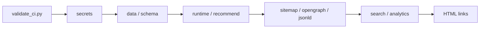
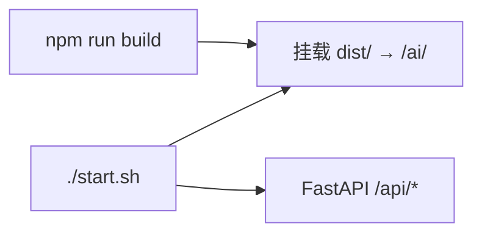

# 系统架构

本文帮助开发者快速建立 **Bio AI Lab** 的全局认知：纯前端静态站点，以 `data/` JSON 为内容源，Astro 生成 HTML，GitHub Actions 负责 CI/CD。

线上地址：https://bio-apple.github.io/ai/

---

## 1. 总览



| 层级   | 技术                   | 职责                                                    |
| ------ | ---------------------- | ------------------------------------------------------- |
| 内容层 | `data/` + 抓取脚本     | 站点文案、工具、对比、排行；新闻/视频/课程/OSS 定时刷新 |
| 构建层 | Astro 5 SSG + prebuild | 编译 ~22 个 HTML 页，打包 CSS/JS，生成搜索索引          |
| 交付层 | GitHub Pages           | 托管 `dist/`，无服务端运行时                            |
| 交互层 | 原生 JS + Fuse.js      | Tab、全站搜索、推荐、漏斗埋点、虚拟列表、链接兜底       |

---

## 2. Astro 静态页面生成

### 2.1 页面模型



**两种布局壳：**

| 布局                     | 用于                          | 特点                                         |
| ------------------------ | ----------------------------- | -------------------------------------------- |
| `HomeLayout.astro`       | `index.astro`                 | SPA 式 Tab、Hero AI 图、知识库 FAB、推荐助手 |
| `StandaloneLayout.astro` | 工具页 / 对比 / 指南 / 排行等 | 独立 `<main>`、面包屑、可选知识库 FAB        |

关键组件：`HeroAiMap.astro`、`Breadcrumb.astro` / `StandalonePageHeader.astro`、`GlobalSearch.astro`。

**路由与输出**（`astro.config.mjs`）：

- `base: '/ai/'` — 适配 GitHub Pages 子路径
- `output: 'static'` — 纯 SSG，构建期生成全部 HTML
- `build.format: 'file'` — 产出 `index.html`、`tools/hub.html` 等文件路径

### 2.2 构建流水线



**prebuild 三步**（`scripts/prebuild.mjs`）：

1. **sync-public** — 根目录 `*.js`、抓取 JSON、`lib/`、`vendor/`、`hero-ai-map*.{svg,webp}`、`_headers` 等复制到 `public/`
2. **bundle-css** — `style.css` 合并 `css/*.css` 为单文件
3. **build-artifacts** — 从 `data/` 生成运行时 JSON（搜索索引、推荐规则、分析配置）

Astro 随后将 `public/` 与 `src/pages` 编译进 `dist/`。

---

## 3. 数据如何驱动内容

### 3.1 数据分类



### 3.2 构建期 vs 运行时

| 时机       | 数据源                                 | 消费方                               | 说明                                              |
| ---------- | -------------------------------------- | ------------------------------------ | ------------------------------------------------- |
| **构建期** | `data/site.json` 等                    | Astro 页面、`src/lib/*.ts`           | `import` 进 HTML，SEO/结构化数据在 SSG 时固化     |
| **运行时** | `ai-news.json`、`daily-videos.json` 等 | `news.js`、`videos.js`、`courses.js` | 页面加载后 `fetch`，支持日更而不重编全部页面逻辑  |
| **运行时** | `search-index.json`                    | `app.js`、`knowledge.js`、顶栏搜索   | Fuse.js 全文检索（工具/资讯/开源/课程/视频/模型） |
| **运行时** | `recommend-rules.json`                 | `recommend.js`                       | 场景关键词 → 工具 + 现实实例 + 步骤               |

首页是 **混合模式**：Hero（含 AI 关联图背景）/ 导航 / 推荐场景 / 面包屑在构建期渲染；新闻/视频/课程/OSS Tab 由 JS 懒加载对应 JSON。

### 3.4 客户端模块（浏览器）

| 模块     | 文件                            | 职责                                                          |
| -------- | ------------------------------- | ------------------------------------------------------------- |
| 搜索     | `app.js` + `GlobalSearch.astro` | 多实例 Fuse；fixed 下拉；`preferSearchHits`；提交按钮 / Enter |
| Hero 图  | `HeroAiMap.astro`               | 响应式 WebP + SVG 回退；中心 scrim                            |
| 面包屑   | `Breadcrumb.astro`              | 专区「首页 / …」；独立页经 `StandalonePageHeader`             |
| 漏斗     | `funnel.js` → `analytics.js`    | `journey_id` / `funnel_step` enrich                           |
| 虚拟列表 | `lib/virtual-list.js`           | 视频 / 榜单 / GitHub 热门                                     |
| 链接兜底 | `lib/link-guard.js`             | noreferrer、图片兜底、GitHub 404                              |
| 开源卡   | `OssCard.astro` + `oss.js`      | Stars / 语言 / 用途 / 仓库按钮                                |
| 懒加载   | `lazy-sections.js`              | Tab 进入后再拉业务脚本                                        |
| 工具中心 | `hub.ts` + `hub.astro`          | 对比表「工具」列 → `tools/{id}.html`（含 jimeng）             |

详见 [FRONTEND.md](./FRONTEND.md)、[CONTENT-FUNNEL.md](./CONTENT-FUNNEL.md)。

### 3.3 定时数据刷新



| 工作流              | 脚本 / 动作             | 产出 / 作用                                        |
| ------------------- | ----------------------- | -------------------------------------------------- |
| `daily-refresh.yml` | 串行调用各 `fetch_*.py` | 视频→开源→课程→排行；一次 push + deploy；lychee    |
| `daily-news.yml`    | `fetch_ai_news.py`      | 北京 07:30/10:00/12:00/20:00 刷新新闻并派发 deploy |
| `daily-*.yml`       | 单频道脚本（仅手动）    | 救急重跑某一频道                                   |
| `site-health.yml`   | `check_site_health.py`  | 线上 JSON 新鲜度探针                               |

`daily-refresh.yml` 于北京 **00:00** 启动；频道**顺序执行**（上一频道完成后再开下一频道），全部抓取结束后统一推送并派发一次 `deploy.yml`。新闻热点由 `daily-news.yml` 于北京 **07:30 / 10:00 / 12:00 / 20:00** 多档刷新。

---

## 4. GitHub Actions 与 CI/CD



| 工作流                | 触发                                                                    | 目的                                                  |
| --------------------- | ----------------------------------------------------------------------- | ----------------------------------------------------- |
| **ci.yml**            | push/PR `main`                                                          | 完整质量门禁（含 E2E），PR 上传 `dist` 预览           |
| **deploy.yml**        | push `main`、手动                                                       | 精简路径：校验通过后尽快发布 Pages                    |
| **daily-refresh.yml** | cron 00:00（北京）                                                      | 串行日更（视频/开源/课程/排行）+ 一次 deploy + lychee |
| **daily-news.yml**    | cron 07:30/10:00/12:00/20:00（北京）= UTC 23:30 / 02:00 / 04:00 / 12:00 | 新闻热点多档刷新 + deploy                             |

push `main` 时 **ci.yml 与 deploy.yml 并行**；deploy 不推 `gh-pages` 分支，而是使用官方 `actions/deploy-pages` 制品部署。

详见 [CI-CD.md](./CI-CD.md)。

---

## 5. 校验与质量门禁

`scripts/validate_ci.py` 在 CI 与 deploy 的 Build 阶段执行：



主要步骤（可单独跑 `DIST=dist python3 scripts/validate_ci.py <step>`）：

`secrets` → `data` → `tool-relations` → `oss` → `videos` → `news` → `courses` → `runtime` → `recommend` → `sitemap` → `opengraph` → `jsonld` → `search` → `analytics` → `engagement` → `links`

另：CI Lint 前跑 **gitleaks**；日更末步 **lychee** 扫外链（见 [CI-CD.md](./CI-CD.md)）。

Schema 文件位于 `schemas/`；手工维护的 `site.json` / `tools.json` 校验 **JSON 可解析 + 交叉引用**（如 `tool-relations` 的 id 必须存在于 `tools.json`）。

---

## 6. 本地开发架构



- **生产（GitHub Pages）**：仅静态文件，无 `/api/*`
- **本地 `./start.sh`**：可选 FastAPI，`/api/ask` 为站内 BM25 检索（非 LLM）；知识库助手会探测 `/api/health` 后决定是否调用

---

## 7. 目录速查

```
data/                 # 手工内容源（见 DATA-MODEL.md）
config/               # 抓取规则 YAML + csp.json
schemas/              # JSON Schema（CI 门禁）
src/pages/            # Astro 路由 → HTML
src/components/       # HeroAiMap / Breadcrumb / GlobalSearch / OssCard / SeoHead …
src/layouts/          # 页面壳
src/lib/              # data 加载、路径、hub 对比映射、Schema.org（schema.ts）
lib/                  # 浏览器共享：fetch-json / virtual-list / link-guard
scripts/              # prebuild / 抓取 / 校验
css/ + *.js           # 样式与运行时脚本
hero-ai-map*.{svg,webp}  # Hero 背景图（sync-public → dist）
dist/                 # 构建产物（不提交）
public/               # prebuild 中间产物（不提交）
```

---

## 相关文档

- [DATA-MODEL.md](./DATA-MODEL.md) — 核心 JSON 字段与 Schema
- [FRONTEND.md](./FRONTEND.md) — 浏览器端能力
- [CONTENT-FUNNEL.md](./CONTENT-FUNNEL.md) — 内容漏斗埋点
- [DEVELOPER.md](../DEVELOPER.md) — 本地开发与常见改动
- [CI-CD.md](./CI-CD.md) — 部署流程
- [SECURITY.md](./SECURITY.md) — API Key 与静态站安全
