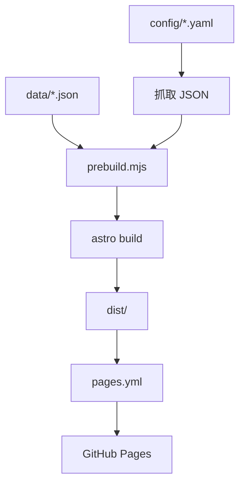

# 系统架构

纯前端静态站：`data/` JSON + 抓取脚本 → Astro SSG → GitHub Pages。  
线上：https://bio-apple.github.io/ai/

## 总览


```mermaid
flowchart TB
  DATA["data/*.json"] --> PRE["prebuild.mjs"]
  FETCH["抓取 JSON"] --> PRE
  CFG["config/*.yaml"] --> FETCH
  PRE --> ASTRO["astro build"]
  ASTRO --> DIST["dist/"]
  DIST --> GHA["pages.yml"]
  GHA --> PAGES["GitHub Pages"]
```

| 层级 | 技术 | 职责 |
|------|------|------|
| 内容 | `data/` + `scripts/fetch_*.py` | 文案、工具、新闻/OSS/课程日更 |
| 构建 | Astro 5 + prebuild | HTML / CSS / 搜索索引 |
| 交付 | GitHub Pages | 静态托管 |
| 交互 | 原生 JS | 搜索、推荐、视频页、漏斗 |
| 云端 | Cloudflare Worker | 视频列表 KV + `/meta` 封面 |

## 构建要点

- `base: '/ai/'` · `output: 'static'` · `build.format: 'file'`
- `scripts/prebuild.mjs`：同步 public、CSP `_headers`、搜索索引、视频 slim JSON
- Layout：`HomeLayout`（首页 Tab）· `StandaloneLayout`（独立页）

## 视频预览

`videos.html`：用户粘贴链接 → `localStorage` + Cloudflare KV 共享同步。详见 [CLOUDFLARE-SYNC.md](./CLOUDFLARE-SYNC.md)。

## 目录

```
data/  config/  content/  src/  lib/  scripts/  workers/video-sync/  schemas/
```

日更与救急 → [CONTENT-OPS.md](./CONTENT-OPS.md)  
部署 → [CI-CD.md](./CI-CD.md)  
开发改动 → [DEVELOPER.md](../DEVELOPER.md)
