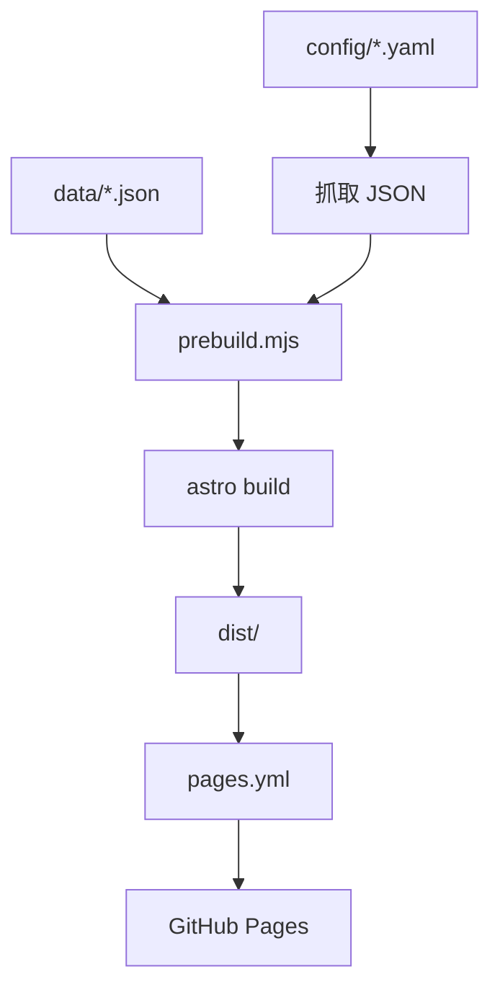

# 系统架构

纯前端静态站：`data/` JSON + 抓取脚本 → Astro SSG → GitHub Pages。  
线上：https://bio-apple.github.io/ai/

## 总览


```mermaid
flowchart TB
  DATA["data/*.json"] --> PRE["prebuild.mjs"]
  FETCH["抓取 JSON"] --> PRE
  CFG["config/*.yaml"] --> FETCH
  PRE --> ASTRO["astro build"]
  ASTRO --> DIST["dist/"]
  DIST --> GHA["pages.yml"]
  GHA --> PAGES["GitHub Pages"]
```

| 层级 | 技术                           | 职责                          |
| ---- | ------------------------------ | ----------------------------- |
| 内容 | `data/` + `scripts/fetch_*.py` | 文案、工具、新闻/OSS/课程日更 |
| 构建 | Astro 7 + prebuild             | HTML / CSS / 搜索索引 / PWA   |
| 交付 | GitHub Pages                   | 静态托管（`base: /ai/`）      |
| 交互 | 原生 JS                        | 搜索、推荐、视频页、漏斗      |
| 云端 | Cloudflare Worker              | 视频列表 KV + `/meta` 封面    |

## 构建要点

- `base: '/ai/'` · `output: 'static'` · `build.format: 'file'`
- `scripts/prebuild.mjs`：同步 public、CSP `_headers`、搜索索引、视频 slim JSON、本地部署文稿
- Layout：`HomeLayout`（首页）· `StandaloneLayout`（独立页 + 本页目录）
- PWA：`sw.js` scope `/ai/`；改版核对需强制刷新，避免旧 HTML

## 页面

| 路径                          | 作用                                                         |
| ----------------------------- | ------------------------------------------------------------ |
| `/ai/`                        | 首页                                                         |
| `/ai/tools/hub.html`          | AI 工具中心（三榜）                                          |
| `/ai/tools/{id}.html`         | 工具详情                                                     |
| `/ai/oss.html`                | 开源精选                                                     |
| `/ai/courses.html`            | 课程资源                                                     |
| `/ai/news/daily-ai-news.html` | 新闻热点：7×24h 资讯 + 量子位官网热门（30 天，并入既有分类） |
| `/ai/videos.html`             | 日更榜 + 粘贴收藏                                            |
| `/ai/guides/advanced.html`    | 进阶指南                                                     |
| `/ai/local/{id}.html`         | 本地部署文稿                                                 |

## 首页信息架构

匹配助手 → AI 简报（模型 / GitHub / 行业资讯 + 近一个月视频精选 3 条）→ 热门排行 → 知识版图 → 下一步（工具中心 + 开源）。  
知识版图：核心圈层与应用交叉可点；外围基础学科黄圈只作图示，图下方按钮不列基础学科。

## 视频

两套数据：日更榜（`daily-videos.json` → 首页 3 条 / 视频页每平台 Top 3）与用户粘贴收藏（`localStorage` + Cloudflare KV）。共享码见 [CLOUDFLARE-SYNC.md](./CLOUDFLARE-SYNC.md)。

## 目录

```
data/  config/  content/  src/  lib/  scripts/  workers/video-sync/  schemas/
```

日更与救急 → [CONTENT-OPS.md](./CONTENT-OPS.md)  
部署 → [CI-CD.md](./CI-CD.md)  
开发改动 → [DEVELOPER.md](../DEVELOPER.md)
