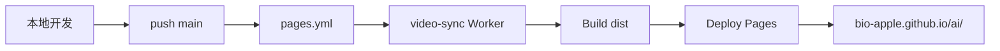

# CI/CD 与一键部署

纯前端静态站，**GitHub Actions** 在 push `main` 后构建并部署至 [GitHub Pages](https://bio-apple.github.io/ai/)。

## 部署流程



1. **本地**：`npm run build` → `dist/`（不提交）。
2. **push `main`**：触发 [`.github/workflows/pages.yml`](../.github/workflows/pages.yml)。
3. **video-sync-api job**：部署 Cloudflare Worker + KV（需 Secrets，见 [CLOUDFLARE-SYNC.md](./CLOUDFLARE-SYNC.md)）。
4. **build job**：prebuild → Astro SSG → `validate_ci.py`。
5. **deploy job**：`actions/deploy-pages` 发布制品。

并行运行 [`.github/workflows/ci.yml`](../.github/workflows/ci.yml)（PR/push 质量门禁：Prettier、单元测试、E2E）。

## 工作流一览

| 工作流                                        | 触发                   | 作用                                                   |
| --------------------------------------------- | ---------------------- | ------------------------------------------------------ |
| [`pages.yml`](../.github/workflows/pages.yml) | push `main` · 手动     | Worker 部署 + 构建 + Pages 发布                        |
| [`ci.yml`](../.github/workflows/ci.yml)       | push/PR `main`         | Lint / 单元测试 / E2E                                  |
| `daily-news.yml`                              | 每日 01:00 北京 · 手动 | 新闻抓取 → push → 派发 `pages.yml`                     |
| `daily-courses.yml`                           | 每日 02:00 北京 · 手动 | 课程抓取                                               |
| `daily-oss.yml`                               | 每日 02:00 北京 · 手动 | 开源精选加热                                           |
| `daily-rankings.yml`                          | 每日 03:00 北京 · 手动 | 排行榜                                                 |
| `daily-videos.yml`                            | **仅手动**             | 日更视频榜（首页 Tab；`videos.html` 已改用户粘贴预览） |
| `site-health.yml`                             | 定时                   | 线上新鲜度探针                                         |
| `weekly-link-check.yml`                       | 定时                   | lychee 外链（软告警）                                  |

## 本地自检

```bash
npm ci && pip install -r requirements.txt
cp .env.local.example .env.local   # 可选
npm run quality
npm run scan:secrets
npm run build
DIST=dist python3 scripts/validate_ci.py
npm run test:unit && npm run test:e2e
```

## 构建变量（GitHub Actions）

| 类型     | 名称                                          | 用途                                        |
| -------- | --------------------------------------------- | ------------------------------------------- |
| Secret   | `CLOUDFLARE_API_TOKEN` / `CLOUDFLARE_API_KEY` | 部署 video-sync Worker                      |
| Secret   | `CLOUDFLARE_ACCOUNT_ID`                       | Cloudflare 账户                             |
| Variable | `VIDEO_SYNC_API_URL`                          | Worker URL 备用                             |
| Variable | `VIDEO_SYNC_SHARED_KEY`                       | 视频列表共享 sync 码（默认 `bioai-videos`） |
| Secret   | `GA_MEASUREMENT_ID` · `CLARITY_PROJECT_ID`    | 分析（可选）                                |

## 故障排查

- 部署失败 → [pages.yml 日志](https://github.com/bio-apple/ai/actions/workflows/pages.yml)
- 视频云端同步失败 → 查 Worker 是否部署、CSP 是否放行 Worker 域名（见 [SECURITY.md](./SECURITY.md)）
- 内容未更新 → 抓取 workflow 是否 push 成功并派发 `pages.yml`

## 相关文档

- [CONTENT-OPS.md](./CONTENT-OPS.md) — 日更抓取与救急
- [CLOUDFLARE-SYNC.md](./CLOUDFLARE-SYNC.md) — 视频预览云端同步
- [SECURITY.md](./SECURITY.md) — CSP 与密钥规范
