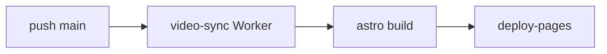

# CI/CD 与部署

push `main` → [pages.yml](../.github/workflows/pages.yml) 构建并发布 [GitHub Pages](https://bio-apple.github.io/ai/)。



并行：[ci.yml](../.github/workflows/ci.yml)（Lint / 单元 / E2E）。

## 工作流

| 工作流                                      | 触发               | 作用                  |
| ------------------------------------------- | ------------------ | --------------------- |
| `pages.yml`                                 | push `main` · 手动 | Worker + 构建 + Pages |
| `ci.yml`                                    | push/PR            | 质量门禁              |
| `daily-news.yml`                            | 01:00 / 12:00 北京 | 新闻                  |
| `daily-oss.yml` / `daily-courses.yml`       | 02:00              | 开源 / 课程           |
| `daily-rankings.yml`                        | 03:00              | 排行                  |
| `daily-videos.yml`                          | 04:00 北京         | 近 1 个月播放量 Top 3 |
| `site-health.yml` / `weekly-link-check.yml` | 定时               | 探针 / lychee         |

完整日更说明 → [CONTENT-OPS.md](./CONTENT-OPS.md)

日更工作流用 token commit 后会**显式派发** `pages.yml`；普通 `git push origin main` 会直接触发 Deploy。

## 本地自检

```bash
cp .env.local.example .env.local   # 可选
npm run quality && npm run scan:secrets && npm run test:unit
npm run build && DIST=dist python3 scripts/validate_ci.py
```

## Secrets / Variables

| 名称              | 用途                                          |
| ----------------- | --------------------------------------------- |
| 分析 ID           | `GA_MEASUREMENT_ID` · `CLARITY_PROJECT_ID` 等 |
| `YOUTUBE_API_KEY` | `daily-videos.yml` YouTube Data API v3        |
| 视频同步          | 见 [CLOUDFLARE-SYNC.md](./CLOUDFLARE-SYNC.md) |

分析与 CSP 细节：[SECURITY.md](./SECURITY.md)
