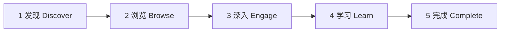

# 内容漏斗（Content Funnel）开发者设计文档

> 站点：https://bio-apple.github.io/ai/

## 1. 文档目标

为 AI 应用指南建立完整的数据分析体系，对用户从访问首页到完成学习的全过程进行跟踪分析，帮助发现：

- 用户最关注什么内容
- 用户在哪里流失
- 哪些教程价值最高
- 哪些页面无人访问
- 哪些搜索词最热门
- 哪些学习路线效果最好

最终实现：

> **数据驱动内容优化，而非凭感觉更新网站。**

---

## 2. 漏斗模型



| 阶段 | `funnel_step` | `funnel_stage` | 典型行为                                |
| ---- | ------------- | -------------- | --------------------------------------- |
| 发现 | 1             | `discover`     | 进入首页、Hero CTA、AI 推荐输入         |
| 浏览 | 2             | `browse`       | Tab 切换、搜索、Daily 面板、工具中心    |
| 深入 | 3             | `engage`       | 打开工具教程页、对比页、推荐结果点工具  |
| 学习 | 4             | `learn`        | 点击课程/视频外链、知识库提问、学习路线 |
| 完成 | 5             | `complete`     | 路线阶段勾选完成、重复访问高价值教程    |

---

## 3. 核心数据字段

所有经 `trackEvent()` 发送的事件，在配置了 `funnel.js` 后会自动附加：

| 字段           | 类型     | 说明                                                                        |
| -------------- | -------- | --------------------------------------------------------------------------- |
| `journey_id`   | `string` | 会话级 UUID（`sessionStorage`），用于串联单次访问路径                       |
| `funnel_step`  | `1–5`    | 事件所属漏斗阶段                                                            |
| `funnel_stage` | `string` | 阶段英文名：`discover` / `browse` / `engage` / `learn` / `complete`         |
| `page_type`    | `string` | 当前页类型：`home` / `tool` / `hub` / `compare` / `ranking` / `roadmap` / … |

业务事件可额外携带：

| 字段                            | 场景                                                                               |
| ------------------------------- | ---------------------------------------------------------------------------------- |
| `tool`                          | 工具 id                                                                            |
| `section`                       | 首页 Tab（`section-courses` 等）                                                   |
| `q`                             | 搜索词（截断 80 字符）                                                             |
| `course_title` / `course_track` | 课程点击                                                                           |
| `entry_source`                  | 入口：`direct` / `search` / `hash` / `search_engine` / `github` / `referral` / UTM |
| `result_count`                  | 搜索命中条数                                                                       |

---

## 4. 技术架构

```
funnel.js          → journey_id、漏斗 enrich、section_view、funnel_entry
analytics.js       → trackEvent() 统一出口 → GA4 / Umami / __clickStats
engagement.js      → 首页运营 widget 本地累加（白名单事件）
recommend.js         → AI 推荐助手（已有 funnel_step 0–2，与全局漏斗并存）
```

**脚本加载顺序**（所有页面）：

```
funnel.js → analytics.js → ux.js → app.js → …
```

**分析后端**（隐私优先，见 `data/analytics.json`）：

1. **Umami** / **Cloudflare Web Analytics**（推荐，无 cookie）
2. **GA4**（可选，需 Measurement ID）
3. **Clarity**（可选，热力图/录屏）
4. 未配置时：仅浏览器内存 `window.__clickStats`（不持久）

---

## 5. 事件清单

### 5.1 漏斗生命周期

| 事件              | 阶段 | 触发                                    |
| ----------------- | ---- | --------------------------------------- |
| `funnel_entry`    | 1    | 每会话首次页面加载                      |
| `section_view`    | 2    | 首页 Tab 切换（`bioai:section-change`） |
| `page_engagement` | 1    | 页面可见 ≥5s（需 GA/Umami）             |

### 5.2 发现 → 浏览

| 事件                                  | 阶段 | 来源                                |
| ------------------------------------- | ---- | ----------------------------------- |
| `hero-cta-primary`                    | 1    | 首页 Hero                           |
| `hero-cta-nav`                        | 2    | 浏览工具中心                        |
| `nav-tab`                             | 2    | 顶栏 Tab                            |
| `search_query`                        | 2    | 搜索输入（600ms 防抖）或 `?q=` 入站 |
| `search_hit` / `search-goto`          | 2    | 搜索结果点击                        |
| `search_empty`                        | 2    | 零结果                              |
| `daily_panel_click`                   | 2    | Daily 面板                          |
| `home-all-oss` / `home-community-hub` | 2    | 首页区块 CTA                        |

### 5.3 浏览 → 深入

| 事件                                  | 阶段 | 来源              |
| ------------------------------------- | ---- | ----------------- |
| `recommend_submit` / `recommend_chip` | 1    | AI 推荐（结果含现实实例 `examples`） |
| `recommend_query_tool`                | 3    | 推荐结果 → 工具页                   |
| `recommend_related_*`                 | 3    | 关联工具                            |
| `ops-tool-click`                      | 3    | 运营热度榜        |
| `tool-rel-alt-*` / `tool-rel-comp-*`  | 3    | 工具页关联        |
| `compare-goto-*`                      | 3    | 对比页 CTA        |

### 5.4 深入 → 学习 → 完成

| 事件                               | 阶段 | 来源                          |
| ---------------------------------- | ---- | ----------------------------- |
| `course-click` / `course-read`     | 4    | 课程 Tab（含 `course_title`） |
| `courses-filter-track`             | 4    | 课程路线筛选                  |
| `video-click` / `home-video-click` | 4    | 视频外链                      |
| `knowledge_ask`                    | 4    | 知识库                        |
| `roadmap_phase_toggle`             | 5    | 学习路线勾选                  |

完整 declarative 事件见各模块 `[data-track]` 与 `trackEvent()` 调用。

---

## 6. 分析维度与报表

### 6.1 Umami（推荐）

在 Umami Dashboard 创建自定义事件报表：

| 问题           | 事件 / 维度                                                                                                         |
| -------------- | ------------------------------------------------------------------------------------------------------------------- |
| 用户最关注什么 | `section_view` × `section`；`course-click` × `course_track`                                                         |
| 在哪里流失     | 漏斗：`funnel_entry` → `section_view` → `recommend_query_tool` → `course-click`（按 `journey_id` 在导出数据中串联） |
| 教程价值       | `tool` 页 `page_view` + `page_engagement`；工具页 `funnel_entry` × `tool`                                           |
| 无人访问页面   | Umami Pages 报表 + 对比 sitemap                                                                                     |
| 热门搜索       | `search_query` × `q`（Top N）                                                                                       |
| 学习路线效果   | `courses-filter-track` + `course-click` × `course_track`；`roadmap_phase_toggle`                                    |

### 6.2 GA4

将 `funnel_step` 注册为自定义维度，在 **Explore → Funnel exploration** 中配置 5 步漏斗。

### 6.3 首页运营 widget

`engagement.js` + `data/engagement.json` 提供**当日热度基准**（浏览/点击），白名单已扩展至 `section_view`、`search_query`、`course-click` 等高意图事件。

---

## 7. 配置与部署

```bash
# 本地：可选 .env.local
UMAMI_SCRIPT_URL=https://cloud.umami.is/script.js
UMAMI_WEBSITE_ID=xxxxxxxx-xxxx-xxxx-xxxx-xxxxxxxxxxxx

# 或 Cloudflare
CLOUDFLARE_BEACON_TOKEN=...

# 构建后 runtime 配置
npm run build   # → dist/analytics-config.json
```

CI Secrets 见 [CI-CD.md](./CI-CD.md)、[SECURITY.md](./SECURITY.md)。

---

## 8. 隐私与合规

- 默认不启用 GA/Clarity；推荐 Umami 或 Cloudflare（无 cookie）
- `journey_id` 仅存 `sessionStorage`，不跨设备追踪
- 搜索词截断 80 字符；不上传用户输入全文至第三方（知识库 `knowledge_ask` 同限）
- CSP 已 allowlist 分析域名（`config/csp.json`）

---

## 9. 实施路线图

| 优先级 | 项                                               | 状态 |
| ------ | ------------------------------------------------ | ---- |
| P0     | `funnel.js` + `trackEvent` enrich                | ✅   |
| P0     | `funnel_entry` / `section_view` / `search_query` | ✅   |
| P0     | 课程点击携带 `course_title` / `course_track`     | ✅   |
| P1     | 工具中心 / 排行榜页 `data-track` 补全            | 待办 |
| P1     | 工具页外链（官方文档）点击追踪                   | 待办 |
| P2     | Umami 漏斗 Dashboard 模板（维护者手动）          | 待办 |
| P2     | 导出脚本：按 `journey_id` 聚合路径               | 待办 |

---

## 10. 本地调试

```javascript
// 浏览器控制台
window.__clickStats; // 事件计数
window.bioFunnel.getJourneyId();
window.bioFunnel.pageType();
trackEvent('course-click', { course_title: 'test', course_track: 'LLM 大模型' });
// → 应含 journey_id、funnel_step: 4、funnel_stage: 'learn'
```

---

## 相关文档

- [FRONTEND.md](./FRONTEND.md) — 前端能力总览（含漏斗脚本加载顺序）
- [DATA-MODEL.md](./DATA-MODEL.md) — `analytics.json` / `engagement.json`
- [SEO.md](./SEO.md) — 搜索可发现性（与行为分析互补）
- [CONTENT-OPS.md](./CONTENT-OPS.md) — 内容运营与 `engagement.json` 维护
- [DEVELOPER.md](../DEVELOPER.md) — 构建与脚本
