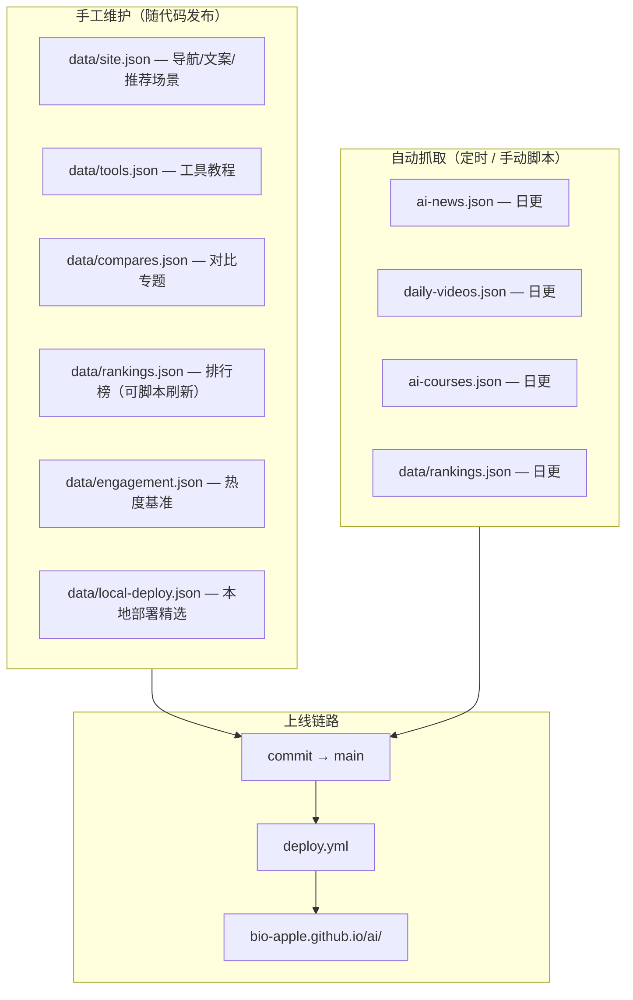
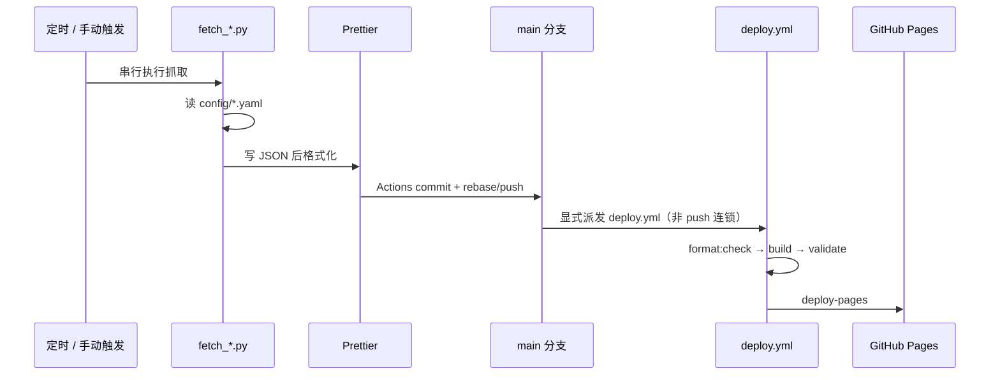

# 数据更新与内容运营指南

本文面向**内容运营者与维护者**：说明哪些内容如何更新、抓取脚本如何工作、定时任务频率，以及从数据变更到线上生效的完整链路。

手工维护的页面文案见 [DATA-MODEL.md](./DATA-MODEL.md)；环境搭建见 [SETUP.md](./SETUP.md)。

---

## 1. 内容分类总览



| 类型          | 代表文件                 | 谁改                    | 上线方式                        |
| ------------- | ------------------------ | ----------------------- | ------------------------------- |
| **站点配置**  | `data/site.json`         | 运营/开发               | push `main` → 自动构建部署      |
| **工具教程**  | `data/tools.json`        | 运营/开发               | 同上                            |
| **本地部署**  | `data/local-deploy.json` | 运营/开发               | 同上（手工精选，非日更抓取）    |
| **动态频道**  | `ai-news.json` 等        | GitHub Actions 定时抓取 | 脚本 commit → 触发 `deploy.yml` |
| **搜索/推荐** | `search-index.json`      | 构建时自动生成          | `npm run build` 时产出          |

---

## 2. 定时任务一览（北京时间）

| 工作流                                                                                   | Cron（北京）                      | 说明                                                                |
| ---------------------------------------------------------------------------------------- | --------------------------------- | ------------------------------------------------------------------- |
| [daily-refresh.yml](https://github.com/bio-apple/ai/actions/workflows/daily-refresh.yml) | 每日 **00:00**                    | **串行**刷新：视频 → 课程 → 排行 → 一次推送/部署 → 死链（不含新闻） |
| [daily-news.yml](https://github.com/bio-apple/ai/actions/workflows/daily-news.yml)       | **07:30 / 10:00 / 12:00 / 20:00** | 新闻热点多档刷新并派发 Deploy                                       |
| [site-health.yml](https://github.com/bio-apple/ai/actions/workflows/site-health.yml)     | 每日 **08:00 / 20:00**            | 线上 JSON 新鲜度探针（不改数据）                                    |
| `daily-videos.yml` / `daily-courses.yml` / `daily-rankings.yml` / `daily-link-check.yml` | 无 cron（仅手动）                 | 单频道救急重跑                                                      |

> `daily-refresh` 在 **00:00** 串行编排（不含新闻）：上一频道抓取并本地 commit 完成后，才开始下一频道。  
> **搜索索引**在每次 `npm run build`（prebuild）由 `build-artifacts.mjs` 重新生成，无需单独抓取。

所有抓取工作流均支持 **Actions → Run workflow** 手动触发。数据有变更时会 **显式** `workflow_dispatch` 触发 [deploy.yml](https://github.com/bio-apple/ai/actions/workflows/deploy.yml)（`GITHUB_TOKEN` push **不会**自动连锁触发其它 workflow）。

---

## 2.1 多角色保障：日更数据库必达线上

| 角色            | 职责                                                                                  | 落点                                       |
| --------------- | ------------------------------------------------------------------------------------- | ------------------------------------------ |
| **数据 / 后端** | 00:00 串行三频道 + 新闻多档（07:30/10:00/12:00/20:00）；频道失败 → job hard-fail      | `daily-refresh.yml` / `daily-news.yml`     |
| **前端工程**    | 提交前 `prettier --write` 日更 JSON，避免 Deploy Prettier 门禁卡死次日数据            | 各频道 Commit 步骤                         |
| **DevOps**      | push 后 **带重试** 派发 `deploy.yml`；rebase 防非快进丢提交                           | Push + Trigger Pages deploy                |
| **QA / 探针**   | 北京 08:00 / 20:00 查线上 videos/news/courses 新鲜度 ≤2 天                            | `site-health.yml` + `check_site_health.py` |
| **内容 / SEO**  | lychee 外链日检为**软告警**（不阻断已 push 的数据上线）；Issues 关闭时写 Step Summary | Report 步骤 + artifact                     |

**标准链路（不可省略派发）：**

```
抓取 → Prettier → commit → rebase/push main → workflow_dispatch(deploy.yml)×重试 → Pages → site-health
```

---

## 3. 从抓取到上线的标准链路



**运营者需知：**

1. 抓取脚本只更新**仓库中的 JSON 文件**，不会直接改线上。
2. 必须有 **deploy 成功**，`dist/` 里的 JSON 才会更新。
3. 本地预览改完 JSON 后需 `npm run build`，否则 Tab 仍显示旧数据。
4. 日更失败看 Actions：频道失败会标红；仅 lychee 失败为软告警，数据仍应已上线。

---

## 4. 抓取脚本详解

### 4.1 课程资源 — `fetch_ai_courses.py`

| 项           | 说明                                                           |
| ------------ | -------------------------------------------------------------- |
| **配置文件** | `config/courses-fetch.yaml`                                    |
| **产出**     | `ai-courses.json`（仓库根目录）                                |
| **频率**     | 每日 00:00 串行队列（`daily-refresh.yml` 第 2 步）；可手动单跑 |
| **依赖**     | `pyyaml`；可选 `GITHUB_TOKEN`（YouTube/GitHub 元数据）         |

**运行机制：**

```
必推荐 required + 合集 hubs
        ↓
若 required_only=false：再抓 Coursera / HF / YouTube 补充课
        ↓
去重合并（URL、标题、合集 vs 单课、每路线≤5）
        ↓
校验必推荐 URL 齐全、条数 ≥ min_items
        ↓
写入 ai-courses.json
```

**核心配置项（`courses-fetch.yaml`）：**

| 配置块                                               | 作用                                                             |
| ---------------------------------------------------- | ---------------------------------------------------------------- |
| `required_only`                                      | `true` 时仅写入必推荐，不抓补充源（当前默认）                    |
| `track_order`                                        | 五条路线顺序：入门 → 机器学习 → 深度学习 → LLM 大模型 → AI Agent |
| `required[]`                                         | 必推荐课程；斯坦福课用最新学年 YouTube 播放列表                  |
| `hubs[]`                                             | 合集入口（当前为空）                                             |
| `dedupe`                                             | `max_per_track: 5`、`prefer_hub_over_children` 等                |
| `coursera` / `huggingface_learn` / `youtube_courses` | 补充源（当前均 `enabled: false`）                                |
| `max_age_days`                                       | 补充课仅收录近 N 天（默认 180）                                  |
| `min_items` / `max_items`                            | 总量下限/上限（失败阈值）                                        |

**本地执行：**

```bash
python3 scripts/fetch_ai_courses.py
DIST=dist python3 scripts/validate_ci.py courses   # 校验
npm run build                                     # 同步进 dist
```

**运营改动示例：**

- 新增必学课 → 编辑 `required[]`，确保 URL 在 `validate_ci.py` 的 `REQUIRED_COURSE_URLS` 中
- 新增 Hugging Face 课 → 编辑 `huggingface_learn.courses[]`
- 调整每路线条数 → 改 `dedupe.max_per_track`（当前 5）

---

### 4.2 新闻热点 — `fetch_ai_news.py`

| 项           | 说明                                                                   |
| ------------ | ---------------------------------------------------------------------- |
| **配置文件** | `config/news-fetch.yaml`                                               |
| **产出**     | `ai-news.json`                                                         |
| **频率**     | 每日 **07:30 / 10:00 / 12:00 / 20:00**（`daily-news.yml`）；可手动单跑 |

**运行机制：**

```
遍历 feeds[]（RSS / HTML 解析 / Nuxt Hub）
        ↓
+ GitHub Trending API（github_trending）
        ↓
过滤近 max_age_days 天（默认 7）
        ↓
标题+URL 去重，按来源多样性挑选
        ↓
写入 ai-news.json（含 watch_sources 关注列表）
```

**核心配置项：**

| 配置块                       | 作用                                                                        |
| ---------------------------- | --------------------------------------------------------------------------- |
| `feeds[]`                    | 新闻源：`url` + `source` + `category`；支持 `type: html_links` / `nuxt_hub` |
| `github_trending`            | GitHub 热门 AI 仓库                                                         |
| `max_age_days`               | 保留窗口（默认 **7 天**）                                                   |
| `max_items` / `max_per_feed` | 总量与单源上限                                                              |
| `category_keywords`          | 根据标题自动分类                                                            |
| `watch_sources`              | 官方博客/X 账号（写入 JSON 供前端展示，非自动抓取）                         |

**本地执行：**

```bash
python3 scripts/fetch_ai_news.py
DIST=dist python3 scripts/validate_ci.py news
```

---

### 4.3 AI 视频 — `fetch_daily_videos.py`

| 项           | 说明                                                                                              |
| ------------ | ------------------------------------------------------------------------------------------------- |
| **配置文件** | `config/video-fetch.yaml`                                                                         |
| **产出**     | `daily-videos.json`、`video-thumbs/bilibili/`                                                     |
| **频率**     | 每日 00:00 串行队列（`daily-refresh.yml` 第 1 步）；可手动单跑                                    |
| **依赖**     | `yt-dlp`（需 Node.js 作 JS runtime）、`pyyaml`；**推荐** `YOUTUBE_API_KEY`（YouTube Data API v3） |

**运行机制：**

```
按六类候选抓取（YouTube / B站 · 均 ≥100 万播放）
        ↓
3d Top3 直接输出；30d Top10 + 100d Top9 合并去重后按播放量最多取 10
        ↓
yt-dlp 搜索 + AI 关键词过滤，分桶按播放量排序
        ↓
摘要清洗（去广告、短链）
        ↓
插入今日新批次到 batches[0]（保留近 60 批历史）
        ↓
B站缩略图下载到 video-thumbs/
```

**命令行参数：**

```bash
python3 scripts/fetch_daily_videos.py          # 今日已有批次则跳过
python3 scripts/fetch_daily_videos.py --force  # 删除今日批次并重新抓取
```

Actions 手动触发时可选 `force=true`。

**核心配置项：**

| 配置块                                       | 作用                                          |
| -------------------------------------------- | --------------------------------------------- |
| `video_categories`                           | 3d Top3 直出；30d+100d 合并 Top10（均≥100万） |
| `platform_merged_top`                        | 30d+100d 合并后最多保留条数（默认 10）        |
| `search_queries` / `bilibili_search_queries` | 搜索关键词                                    |
| `ai_keyword_pattern`                         | 标题须匹配的 AI 关键词（唯一内容门槛）        |
| `summary.strip_patterns`                     | 摘要广告过滤正则                              |

**注意：** YouTube 在 CI/数据中心 IP 上常被反爬（`Sign in to confirm you're not a bot`），导致 **搜索有结果、详情全失败** → 六类为空。

**避免 YouTube 为空的措施（按推荐顺序）：**

1. **配置 `YOUTUBE_API_KEY`**（GitHub Actions Secret + 本地 `.env.local`）  
   脚本在拉取单条视频详情时优先/回退使用 [YouTube Data API v3](https://developers.google.com/youtube/v3)（`videos.list`），不受 yt-dlp 反爬影响。免费配额通常足够每日抓取（约数百次 `videos.list`）。
2. **可选 `YTDLP_COOKIES_FILE`**：指向 Netscape 格式 cookies 文件，供 yt-dlp 在无 API Key 时尝试通过登录态绕过（需定期更新，不适合长期无人值守）。
3. **抓取层回退**：若今日 YouTube 仍为空，脚本会**沿用上一有货批次**的 YouTube 分类，避免用空数据覆盖 `daily-videos.json`。
4. **展示层回退**：构建 `daily-videos.latest.json` 时预合并历史分类（见 PR #28）；B 站有货时页面不会整页空白。

Actions 手动触发可选 `force=true` 重抓；日志中 `detail_fetch_failed` + bot 文案即属反爬。

---

### 4.4 工具排行榜 — `fetch_rankings.py`

| 项       | 说明                                       |
| -------- | ------------------------------------------ |
| **配置** | 脚本内 URL 与解析规则                      |
| **产出** | `data/rankings.json`                       |
| **频率** | 每日 00:00 串行队列（第 3 步）；可手动单跑 |

**数据源（各 Top 10）：**

1. AICPB Global AI Website 访问量
2. LMSYS Chatbot Arena Elo
3. Artificial Analysis Intelligence Index

**本地执行：**

```bash
python3 scripts/fetch_rankings.py
git add data/rankings.json && git commit -m "chore: refresh rankings" && git push
```

任一源失败则**整次失败**，保留仓库内上一版。

---

## 5. 手工维护内容（非抓取）

适合运营直接编辑、随 `main` 发布的内容：

| 想改什么                | 文件                                                 | 注意事项                                             |
| ----------------------- | ---------------------------------------------------- | ---------------------------------------------------- |
| 首页文案 / 导航 / FAQ   | `data/site.json`                                     | 改完 `npm run build` 本地预览                        |
| 工具教程页              | `data/tools.json`                                    | `id` 唯一；与 `tool-relations.json` 一致             |
| 对比专题                | `data/compares.json`                                 | 每篇一个 `slug`                                      |
| 推荐场景芯片 / 现实实例 | `site.json` → `ai_picker.options`（含 `examples[]`） | 重建后更新 `recommend-rules.json`                    |
| 工具中心对比表          | `site.json` → `compare_table`                        | hub 构建时链到 `tools/{id}.html`                     |
| 热度展示基准            | `data/engagement.json`                               | `tools[].id` 不可重复                                |
| 本地部署精选            | `data/local-deploy.json`                             | 手工维护；改 `updated_at`；CI `validate_ci.py local` |
| AI 领域地图             | `HomeAiMap.astro` + `.ai-map*`                       | 首页 `#home-ai-map` 原生层级图；见 FRONTEND.md       |

字段定义详见 [DATA-MODEL.md](./DATA-MODEL.md)。

**发布流程：**

```bash
# 1. 编辑 data/*.json
# 2. 本地验证
npm run build
DIST=dist python3 scripts/validate_ci.py

# 3. 提交
git add data/ && git commit -m "content: 更新 xxx" && git push
# push main 后 deploy.yml 自动部署
```

---

## 6. 手动刷新速查

在 GitHub Actions 界面 **Run workflow**，或本地执行后 push：

| 场景            | 命令 / 操作                                                              |
| --------------- | ------------------------------------------------------------------------ |
| 新闻不新        | Actions → **Daily AI News Update**                                       |
| 视频空白 / 过期 | Actions → **Daily AI Video Update**（可 `force=true`）                   |
| 课程 Tab 异常   | Actions → **Daily AI Courses Update**                                    |
| 排行榜过时      | Actions → **Daily AI Rankings Update** 或本地 `fetch_rankings.py` + push |
| 仅重部署        | Actions → **Deploy**（不改数据）                                         |

**本地一键刷新全部动态数据：**

```bash
python3 scripts/fetch_ai_news.py
python3 scripts/fetch_daily_videos.py
python3 scripts/fetch_ai_courses.py
python3 scripts/fetch_rankings.py
npm run build
DIST=dist python3 scripts/validate_ci.py
```

---

## 6.5 抓取幂等与容灾

所有 `scripts/fetch_*.py` 共享 `scripts/fetch_resilience.py`：

| 能力               | 说明                                                                                        |
| ------------------ | ------------------------------------------------------------------------------------------- |
| **指数退避重试**   | YouTube Data API、GitHub API、RSS/HTTP 遇 429/5xx/超时自动重试（默认最多 4 次，1s→2s→4s…）  |
| **原子写入**       | 先写 `*.json.tmp` 再 `rename`，避免半截文件                                                 |
| **失败保留旧数据** | 抓取结果为空或未达标时**不覆盖**已有 JSON；脚本 **exit 0**（有历史）或 **exit 1**（无历史） |

各脚本行为：

- **daily-videos**：今日全空则不写入；`--force` 失败时恢复 force 前的今日批次
- **ai-news**：0 条新闻时保留 `ai-news.json`
- **ai-courses**：条数不足或必收录缺失时保留 `ai-courses.json`

CI 仍会通过 `report_fetch_metrics.py` 告警，但**不会因单次 API 抖动阻断 commit**（视频 workflow 设计为 metrics 开 Issue、不 fail job）。

本地自检：`python3 -m unittest discover -s tests/unit -p 'test_fetch*.py'`

---

## 7. 质量监控

| 机制                        | 说明                                                                      |
| --------------------------- | ------------------------------------------------------------------------- |
| **validate_ci.py**          | Schema、去重、必收录、OG/JSON-LD、搜索索引、内部链接等                    |
| **gitleaks**                | CI Lint 前密钥历史扫描（与 `validate_ci secrets` 双重）                   |
| **report_fetch_metrics.py** | 视频/新闻抓取后写 GitHub Step Summary；视频严重不足开 Issue               |
| **site-health.yml**         | 探针检查视频/新闻/课程 JSON 是否在 2 天内更新                             |
| **daily-refresh.yml**       | 00:00 串行日更（不含新闻）+ lychee（软）；**频道失败**开 `[ops]` Issue    |
| **daily-news.yml**          | 07:30/10:00/12:00/20:00 新闻热点；失败开 `[ops] Daily news fetch failed`  |
| **失败 Issue**              | 各定时工作流失败时尽量开/更新 `[ops]` Issue；Issues 关闭则写 Step Summary |
| **内容漏斗**                | 前端 `funnel.js` 埋点；详见 [FRONTEND.md](./FRONTEND.md) §6               |

探针阈值（可环境变量覆盖）：

- `VIDEO_MAX_AGE_DAYS=2`
- `NEWS_MAX_AGE_DAYS=2`

---

## 8. 常见问题

| 症状                 | 原因                | 处理                                                                          |
| -------------------- | ------------------- | ----------------------------------------------------------------------------- |
| Tab 有数据但线上没有 | deploy 未跑或失败   | 查 [deploy.yml](https://github.com/bio-apple/ai/actions/workflows/deploy.yml) |
| 本地有数据线上空     | 未 push 或未 build  | `git push` + 等 deploy                                                        |
| 课程必收录缺失       | 源站 URL 变更       | 更新 `courses-fetch.yaml` → `required`                                        |
| YouTube 视频类为空   | CI 环境 yt-dlp 限制 | 用 `force=true` 重试；B站有货仍会更新                                         |

---

## 9. 故障救急

### 9.1 告警怎么处理

1. **首页 / JSON 404** → 查 [CI](https://github.com/bio-apple/ai/actions/workflows/ci.yml) / [Deploy](https://github.com/bio-apple/ai/actions/workflows/deploy.yml) → 本地 `npm run build && DIST=dist python3 scripts/validate_ci.py` → 重部署
2. **多频道过期 / 串行日更失败** → 查 [daily-refresh.yml](https://github.com/bio-apple/ai/actions/workflows/daily-refresh.yml)（北京 00:00 串行）→ 可手动 **Run workflow** 重跑全链路。仅 lychee 软告警时：数据应已上线，修外链即可
3. **仓库已更新但线上仍昨日** → 确认 `deploy.yml` 是否被派发成功（`GITHUB_TOKEN` push **不会**自动触发 Deploy）→ 手动 Run [deploy.yml](https://github.com/bio-apple/ai/actions/workflows/deploy.yml)
4. **视频仍显示昨日** → 确认 `main` 上 `daily-videos.json` 的 `batches[0].date`；仅视频坏 → [daily-videos.yml](https://github.com/bio-apple/ai/actions/workflows/daily-videos.yml)（`force=true`）
   - YouTube 全空：配置 **`YOUTUBE_API_KEY`** 后重跑
5. **新闻过期** → [daily-news.yml](https://github.com/bio-apple/ai/actions/workflows/daily-news.yml)（定时北京 **07:30 / 10:00 / 12:00 / 20:00**；可手动 Run）
6. **课程资源异常** → [daily-courses.yml](https://github.com/bio-apple/ai/actions/workflows/daily-courses.yml)
7. **排行榜异常** → [daily-rankings.yml](https://github.com/bio-apple/ai/actions/workflows/daily-rankings.yml)
8. **Dead Link 告警** → [daily-refresh.yml](https://github.com/bio-apple/ai/actions/workflows/daily-refresh.yml) artifact（或手动 [daily-link-check.yml](https://github.com/bio-apple/ai/actions/workflows/daily-link-check.yml)）；不阻断日更上线
9. **Deploy Prettier 失败** → 日更已在提交前格式化；若仍失败，本地 `npx prettier --write <json>` 后 push

### 9.2 死链：用户侧 vs 日检

| 层级         | 机制                           | 说明                                                       |
| ------------ | ------------------------------ | ---------------------------------------------------------- |
| **用户侧**   | `lib/link-guard.js`            | 点击 GitHub 仓库前探测 API；404 弹窗，避免盲跳             |
| **运维日检** | lychee（`daily-refresh` 末步） | 扫描 `dist` HTML 与 JSON 外链；失败为**软告警** + artifact |

### 9.3 课程资源专项

```bash
python3 scripts/fetch_ai_courses.py
DIST=dist python3 scripts/validate_ci.py courses
```

| 报错               | 处置                                                                              |
| ------------------ | --------------------------------------------------------------------------------- |
| 必收录课程缺失     | 检查 `config/courses-fetch.yaml` → `required` / `hubs` 与网络可达性               |
| 合集与下属单课重复 | 确认 `dedupe.prefer_hub_over_children: true`，且 `deeplearning_ai.enabled: false` |
| 单条路线超过 5 门  | 调低补充源或检查 `dedupe.max_per_track`                                           |

### 9.4 工作流快捷入口

- [Daily Content Refresh（00:00 串行）](https://github.com/bio-apple/ai/actions/workflows/daily-refresh.yml)
- [Daily videos](https://github.com/bio-apple/ai/actions/workflows/daily-videos.yml)（手动）
- [Daily news](https://github.com/bio-apple/ai/actions/workflows/daily-news.yml)（**07:30 / 10:00 / 12:00 / 20:00** / 手动）
- [Daily courses](https://github.com/bio-apple/ai/actions/workflows/daily-courses.yml)（手动）
- [Daily rankings](https://github.com/bio-apple/ai/actions/workflows/daily-rankings.yml)（手动）
- [Daily link check](https://github.com/bio-apple/ai/actions/workflows/daily-link-check.yml)（手动）
- [Site health](https://github.com/bio-apple/ai/actions/workflows/site-health.yml)
- [CI / Pages](https://github.com/bio-apple/ai/actions)

### 9.5 回滚

```bash
git checkout <good-sha> -- daily-videos.json video-thumbs/ ai-news.json ai-courses.json data/rankings.json
git commit -m "revert: 回滚坏批次" && git push
```

回滚后若课程有变更，建议再跑一遍 `npm run build` 与 `validate_ci.py`，确认 Pages 部署成功。

---

## 10. 运营检查清单（每日 / 每周抽检）

- [ ] [site-health](https://github.com/bio-apple/ai/actions/workflows/site-health.yml) 无失败
- [ ] 「AI 视频」「新闻热点」最新批次为今日或昨日
- [ ] 「课程资源」「排行榜」`updated_at` 在 2 天内
- [ ] 「课程资源」五条路线均有课（每路线 ≤5）
- [ ] 「本地部署」条目与外链可访问（`data/local-deploy.json`）
- [ ] 无未关闭的 `[ops]` Issue（含 Dead Link / 抓取失败）
- [ ] [daily-refresh](https://github.com/bio-apple/ai/actions/workflows/daily-refresh.yml) 无未处理失败
- [ ] 本地或 CI 构建后搜索可用（顶栏 / Hero 联想与「ChatGPT」→ 教程页）
- [ ] 首页专区与工具中心可见「首页 / …」面包屑
- [ ] 首页 `#home-ai-map` 层级图清晰可读（窄屏字号正常），Hero 无信息图叠字

---

## 相关文档

- [DATA-MODEL.md](./DATA-MODEL.md) — JSON 字段定义
- [FRONTEND.md](./FRONTEND.md) — 搜索 / 漏斗 / 虚拟列表
- [ARCHITECTURE.md](./ARCHITECTURE.md) — 数据流与构建架构
- [DEVELOPER.md](../DEVELOPER.md) — 开发速查
- [CI-CD.md](./CI-CD.md) — 部署流程
