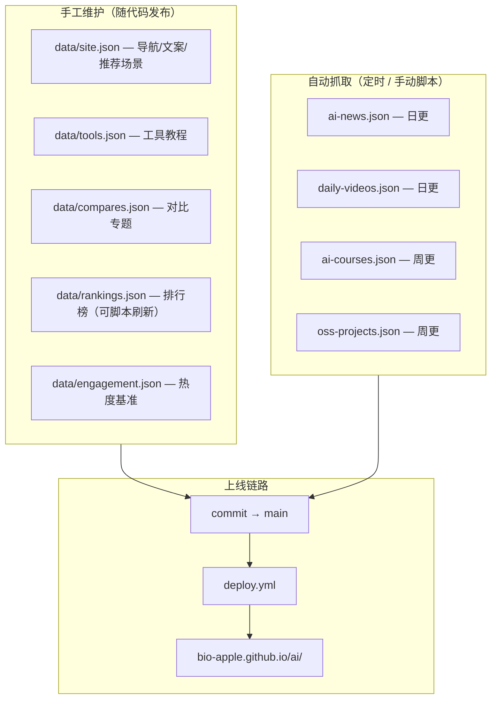
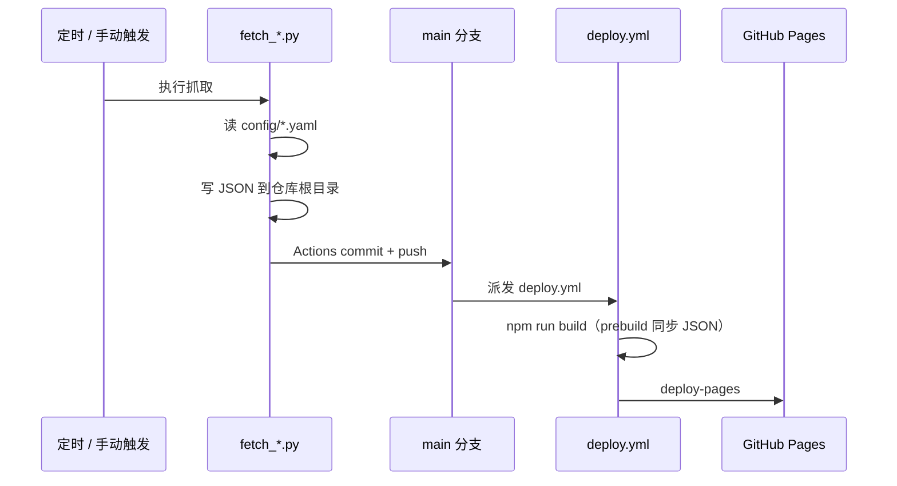

# 数据更新与内容运营指南

本文面向**内容运营者与维护者**：说明哪些内容如何更新、抓取脚本如何工作、定时任务频率，以及从数据变更到线上生效的完整链路。

手工维护的页面文案见 [DATA-MODEL.md](./DATA-MODEL.md)；环境搭建见 [SETUP.md](./SETUP.md)；故障救急见 [OPS-RUNBOOK.md](./OPS-RUNBOOK.md)。

---

## 1. 内容分类总览



| 类型          | 代表文件            | 谁改                    | 上线方式                        |
| ------------- | ------------------- | ----------------------- | ------------------------------- |
| **站点配置**  | `data/site.json`    | 运营/开发               | push `main` → 自动构建部署      |
| **工具教程**  | `data/tools.json`   | 运营/开发               | 同上                            |
| **动态频道**  | `ai-news.json` 等   | GitHub Actions 定时抓取 | 脚本 commit → 触发 `deploy.yml` |
| **搜索/推荐** | `search-index.json` | 构建时自动生成          | `npm run build` 时产出          |

---

## 2. 定时任务一览（北京时间）

| 频道         | 工作流                                                                                     | Cron（北京）           | 脚本                    | 产出文件                                       |
| ------------ | ------------------------------------------------------------------------------------------ | ---------------------- | ----------------------- | ---------------------------------------------- |
| **AI 视频**  | [daily-videos.yml](https://github.com/bio-apple/ai/actions/workflows/daily-videos.yml)     | 每日 **00:00**         | `fetch_daily_videos.py` | `daily-videos.json` + `video-thumbs/`          |
| **新闻热点** | [daily-news.yml](https://github.com/bio-apple/ai/actions/workflows/daily-news.yml)         | 每日 **06:00**         | `fetch_ai_news.py`      | `ai-news.json`                                 |
| **开源精选** | [weekly-oss.yml](https://github.com/bio-apple/ai/actions/workflows/weekly-oss.yml)         | 每周一 **06:00**       | `fetch_oss_stars.py`    | `data/oss-projects.json` + `oss-projects.json` |
| **课程资源** | [weekly-courses.yml](https://github.com/bio-apple/ai/actions/workflows/weekly-courses.yml) | 每周一 **07:00**       | `fetch_ai_courses.py`   | `ai-courses.json`                              |
| **线上探针** | [site-health.yml](https://github.com/bio-apple/ai/actions/workflows/site-health.yml)       | 每日 **08:00 / 20:00** | `check_site_health.py`  | 仅检测，不改数据                               |

> **排行榜**（`data/rankings.json`）暂无定时工作流，需手动执行 `fetch_rankings.py` 后 push。

所有抓取工作流均支持 **Actions → Run workflow** 手动触发。数据有变更时会自动 `workflow_dispatch` 触发 [deploy.yml](https://github.com/bio-apple/ai/actions/workflows/deploy.yml) 重新部署。

---

## 3. 从抓取到上线的标准链路



**运营者需知：**

1. 抓取脚本只更新**仓库中的 JSON 文件**，不会直接改线上。
2. 必须有 **deploy 成功**，`dist/` 里的 JSON 才会更新。
3. 本地预览改完 JSON 后需 `npm run build`，否则 Tab 仍显示旧数据。

---

## 4. 抓取脚本详解

### 4.1 课程资源 — `fetch_ai_courses.py`

| 项           | 说明                                                   |
| ------------ | ------------------------------------------------------ |
| **配置文件** | `config/courses-fetch.yaml`                            |
| **产出**     | `ai-courses.json`（仓库根目录）                        |
| **频率**     | 每周一 07:00（北京）；可手动触发                       |
| **依赖**     | `pyyaml`；可选 `GITHUB_TOKEN`（YouTube/GitHub 元数据） |

**运行机制：**

```
必收录 required + 合集 hubs
        ↓
补充抓取：Coursera 免费课 / Hugging Face Learn / YouTube 频道
        ↓
按 track_keywords 映射到五条路线
        ↓
去重合并（URL、标题、合集 vs 单课、每路线≤5）
        ↓
校验必收录 URL 齐全、条数 ≥ min_items
        ↓
写入 ai-courses.json
```

**核心配置项（`courses-fetch.yaml`）：**

| 配置块                                               | 作用                                                             |
| ---------------------------------------------------- | ---------------------------------------------------------------- |
| `track_order`                                        | 五条路线顺序：入门 → 机器学习 → 深度学习 → LLM 大模型 → AI Agent |
| `required[]`                                         | 必收录课程（不受 `max_age_days` 限制）                           |
| `hubs[]`                                             | 合集入口（如 DeepLearning.AI 短课合集）                          |
| `dedupe`                                             | `max_per_track: 5`、`prefer_hub_over_children` 等                |
| `coursera` / `huggingface_learn` / `youtube_courses` | 补充源开关与参数                                                 |
| `max_age_days`                                       | 补充课仅收录近 N 天（默认 180）                                  |
| `min_items` / `max_items`                            | 总量下限/上限（失败阈值）                                        |

**本地执行：**

```bash
python3 scripts/fetch_ai_courses.py
DIST=dist python3 scripts/validate_ci.py courses   # 校验
npm run build                                     # 同步进 dist
```

**运营改动示例：**

- 新增必学课 → 编辑 `required[]`，确保 URL 在 `validate_ci.py` 的 `REQUIRED_COURSE_URLS` 中
- 新增 Hugging Face 课 → 编辑 `huggingface_learn.courses[]`
- 调整每路线条数 → 改 `dedupe.max_per_track`（当前 5）

---

### 4.2 新闻热点 — `fetch_ai_news.py`

| 项           | 说明                     |
| ------------ | ------------------------ |
| **配置文件** | `config/news-fetch.yaml` |
| **产出**     | `ai-news.json`           |
| **频率**     | 每日 06:00（北京）       |

**运行机制：**

```
遍历 feeds[]（RSS / HTML 解析 / Nuxt Hub）
        ↓
+ GitHub Trending API（github_trending）
        ↓
过滤近 max_age_days 天（默认 7）
        ↓
排除已在 oss-projects.json 中的 GitHub URL
        ↓
标题+URL 去重，按来源多样性挑选
        ↓
写入 ai-news.json（含 watch_sources 关注列表）
```

**核心配置项：**

| 配置块                       | 作用                                                                        |
| ---------------------------- | --------------------------------------------------------------------------- |
| `feeds[]`                    | 新闻源：`url` + `source` + `category`；支持 `type: html_links` / `nuxt_hub` |
| `github_trending`            | GitHub 热门 AI 仓库                                                         |
| `max_age_days`               | 保留窗口（默认 **7 天**）                                                   |
| `max_items` / `max_per_feed` | 总量与单源上限                                                              |
| `category_keywords`          | 根据标题自动分类                                                            |
| `watch_sources`              | 官方博客/X 账号（写入 JSON 供前端展示，非自动抓取）                         |

**本地执行：**

```bash
python3 scripts/fetch_ai_news.py
DIST=dist python3 scripts/validate_ci.py news
```

---

### 4.3 AI 视频 — `fetch_daily_videos.py`

| 项           | 说明                                                                                              |
| ------------ | ------------------------------------------------------------------------------------------------- |
| **配置文件** | `config/video-fetch.yaml`                                                                         |
| **产出**     | `daily-videos.json`、`video-thumbs/bilibili/`                                                     |
| **频率**     | 每日 00:00（北京）                                                                                |
| **依赖**     | `yt-dlp`（需 Node.js 作 JS runtime）、`pyyaml`；**推荐** `YOUTUBE_API_KEY`（YouTube Data API v3） |

**运行机制：**

```
按六类分类抓取（YouTube/B站 × 100d/30d/24h）
        ↓
yt-dlp 搜索 + 播放量/上新时间过滤
        ↓
摘要清洗（去广告、短链）
        ↓
插入今日新批次到 batches[0]（保留近 60 批历史）
        ↓
B站缩略图下载到 video-thumbs/
```

**命令行参数：**

```bash
python3 scripts/fetch_daily_videos.py          # 今日已有批次则跳过
python3 scripts/fetch_daily_videos.py --force  # 删除今日批次并重新抓取
```

Actions 手动触发时可选 `force=true`。

**核心配置项：**

| 配置块                                       | 作用                        |
| -------------------------------------------- | --------------------------- |
| `video_categories`                           | 六类窗口、Top N、最低播放量 |
| `search_queries` / `bilibili_search_queries` | 搜索关键词                  |
| `ai_keyword_pattern`                         | 标题须匹配的 AI 关键词      |
| `summary.strip_patterns`                     | 摘要广告过滤正则            |

**注意：** YouTube 在 CI/数据中心 IP 上常被反爬（`Sign in to confirm you're not a bot`），导致 **搜索有结果、详情全失败** → 六类为空。

**避免 YouTube 为空的措施（按推荐顺序）：**

1. **配置 `YOUTUBE_API_KEY`**（GitHub Actions Secret + 本地 `.env.local`）  
   脚本在拉取单条视频详情时优先/回退使用 [YouTube Data API v3](https://developers.google.com/youtube/v3)（`videos.list`），不受 yt-dlp 反爬影响。免费配额通常足够每日抓取（约数百次 `videos.list`）。
2. **可选 `YTDLP_COOKIES_FILE`**：指向 Netscape 格式 cookies 文件，供 yt-dlp 在无 API Key 时尝试通过登录态绕过（需定期更新，不适合长期无人值守）。
3. **抓取层回退**：若今日 YouTube 仍为空，脚本会**沿用上一有货批次**的 YouTube 分类，避免用空数据覆盖 `daily-videos.json`。
4. **展示层回退**：构建 `daily-videos.latest.json` 时预合并历史分类（见 PR #28）；B 站有货时页面不会整页空白。

Actions 手动触发可选 `force=true` 重抓；日志中 `detail_fetch_failed` + bot 文案即属反爬。

---

### 4.4 开源精选 — `fetch_oss_stars.py`

| 项       | 说明                                                 |
| -------- | ---------------------------------------------------- |
| **配置** | 脚本内 `APP_CATALOG`（按 AI 应用领域分类的候选仓库） |
| **产出** | `data/oss-projects.json` + `oss-projects.json`       |
| **频率** | 每周一 06:00（北京）                                 |
| **依赖** | **强烈建议** `GITHUB_TOKEN`（否则易 API 限流）       |

**规则（代码内常量）：**

- 按 **8 个 AI 应用领域** 分类
- 全球榜：Stars **≥ 50,000**，每类 Top **5**
- 每类额外 **中文 Top1**（候选池 `zh_candidates`）

**本地执行：**

```bash
export GITHUB_TOKEN=ghp_xxx   # 或写入 .env.local
python3 scripts/fetch_oss_stars.py
DIST=dist python3 scripts/validate_ci.py oss
```

**运营改动：** 增删候选仓库 → 编辑 `scripts/fetch_oss_stars.py` 中 `APP_CATALOG`（需开发协助）。

---

### 4.5 工具排行榜 — `fetch_rankings.py`

| 项       | 说明                   |
| -------- | ---------------------- |
| **配置** | 脚本内 URL 与解析规则  |
| **产出** | `data/rankings.json`   |
| **频率** | **无定时任务**，需手动 |

**数据源（各 Top 10）：**

1. AICPB Global AI Website 访问量
2. LMSYS Chatbot Arena Elo
3. Artificial Analysis Intelligence Index

**本地执行：**

```bash
python3 scripts/fetch_rankings.py
git add data/rankings.json && git commit -m "chore: refresh rankings" && git push
```

任一源失败则**整次失败**，保留仓库内上一版。

---

## 5. 手工维护内容（非抓取）

适合运营直接编辑、随 `main` 发布的内容：

| 想改什么              | 文件                              | 注意事项                                 |
| --------------------- | --------------------------------- | ---------------------------------------- |
| 首页文案 / 导航 / FAQ | `data/site.json`                  | 改完 `npm run build` 本地预览            |
| 工具教程页            | `data/tools.json`                 | `id` 唯一；与 `tool-relations.json` 一致 |
| 对比专题              | `data/compares.json`              | 每篇一个 `slug`                          |
| 推荐场景芯片          | `site.json` → `ai_picker.options` | 重建后更新 `recommend-rules.json`        |
| 工具中心对比表        | `site.json` → `compare_table`     |                                          |
| 热度展示基准          | `data/engagement.json`            | `tools[].id` 不可重复                    |

字段定义详见 [DATA-MODEL.md](./DATA-MODEL.md)。

**发布流程：**

```bash
# 1. 编辑 data/*.json
# 2. 本地验证
npm run build
DIST=dist python3 scripts/validate_ci.py

# 3. 提交
git add data/ && git commit -m "content: 更新 xxx" && git push
# push main 后 deploy.yml 自动部署
```

---

## 6. 手动刷新速查

在 GitHub Actions 界面 **Run workflow**，或本地执行后 push：

| 场景            | 命令 / 操作                                            |
| --------------- | ------------------------------------------------------ |
| 新闻不新        | Actions → **Daily AI News Update**                     |
| 视频空白 / 过期 | Actions → **Daily AI Video Update**（可 `force=true`） |
| 课程 Tab 异常   | Actions → **Weekly AI Courses Update**                 |
| OSS 数据过旧    | Actions → **Weekly OSS Stars Update**                  |
| 排行榜过时      | 本地 `python3 scripts/fetch_rankings.py` + push        |
| 仅重部署        | Actions → **Deploy**（不改数据）                       |

**本地一键刷新全部动态数据：**

```bash
python3 scripts/fetch_ai_news.py
python3 scripts/fetch_daily_videos.py
python3 scripts/fetch_ai_courses.py
python3 scripts/fetch_oss_stars.py   # 需 GITHUB_TOKEN
python3 scripts/fetch_rankings.py
npm run build
DIST=dist python3 scripts/validate_ci.py
```

---

## 6.5 抓取幂等与容灾

所有 `scripts/fetch_*.py` 共享 `scripts/fetch_resilience.py`：

| 能力               | 说明                                                                                        |
| ------------------ | ------------------------------------------------------------------------------------------- |
| **指数退避重试**   | YouTube Data API、GitHub API、RSS/HTTP 遇 429/5xx/超时自动重试（默认最多 4 次，1s→2s→4s…）  |
| **原子写入**       | 先写 `*.json.tmp` 再 `rename`，避免半截文件                                                 |
| **失败保留旧数据** | 抓取结果为空或未达标时**不覆盖**已有 JSON；脚本 **exit 0**（有历史）或 **exit 1**（无历史） |

各脚本行为：

- **daily-videos**：今日全空则不写入；`--force` 失败时恢复 force 前的今日批次
- **ai-news**：0 条新闻时保留 `ai-news.json`
- **ai-courses**：条数不足或必收录缺失时保留 `ai-courses.json`
- **oss-projects**：有效领域 &lt;6 时保留 `oss-projects.json`

CI 仍会通过 `report_fetch_metrics.py` 告警，但**不会因单次 API 抖动阻断 commit**（视频 workflow 设计为 metrics 开 Issue、不 fail job）。

本地自检：`python3 -m unittest discover -s tests/unit -p 'test_fetch*.py'`

---

## 7. 质量监控

| 机制                        | 说明                                                        |
| --------------------------- | ----------------------------------------------------------- |
| **validate_ci.py**          | push/部署前 Schema、去重、必收录、链接检查                  |
| **report_fetch_metrics.py** | 视频/新闻抓取后写 GitHub Step Summary；视频严重不足开 Issue |
| **site-health.yml**         | 探针检查线上 JSON 是否在 2 天内更新                         |
| **失败 Issue**              | 各定时工作流失败时自动开/更新 `[ops]` Issue                 |

探针阈值（可环境变量覆盖）：

- `VIDEO_MAX_AGE_DAYS=2`
- `NEWS_MAX_AGE_DAYS=2`

---

## 8. 常见问题

| 症状                 | 原因                | 处理                                                                          |
| -------------------- | ------------------- | ----------------------------------------------------------------------------- |
| Tab 有数据但线上没有 | deploy 未跑或失败   | 查 [deploy.yml](https://github.com/bio-apple/ai/actions/workflows/deploy.yml) |
| 本地有数据线上空     | 未 push 或未 build  | `git push` + 等 deploy                                                        |
| 新闻与开源重复       | 旧批次未去重        | 重跑 `fetch_ai_news.py`                                                       |
| 课程必收录缺失       | 源站 URL 变更       | 更新 `courses-fetch.yaml` → `required`                                        |
| OSS 抓取失败         | GitHub API 限流     | 配置 `GITHUB_TOKEN` 后重跑                                                    |
| YouTube 视频类为空   | CI 环境 yt-dlp 限制 | 用 `force=true` 重试；B站有货仍会更新                                         |

更详细的救急步骤 → [OPS-RUNBOOK.md](./OPS-RUNBOOK.md)。

---

## 9. 运营检查清单（每周）

- [ ] [site-health](https://github.com/bio-apple/ai/actions/workflows/site-health.yml) 无失败
- [ ] 首页「新闻热点」日期在 7 天窗口内
- [ ] 「AI 视频」最新批次为今日或昨日
- [ ] 「课程资源」五条路线均有课（每路线 ≤5）
- [ ] 「开源精选」Star 数合理、无重复仓库
- [ ] 无未关闭的 `[ops]` Issue

---

## 相关文档

- [DATA-MODEL.md](./DATA-MODEL.md) — JSON 字段定义
- [ARCHITECTURE.md](./ARCHITECTURE.md) — 数据流与构建架构
- [OPS-RUNBOOK.md](./OPS-RUNBOOK.md) — 告警与回滚
- [DEVELOPER.md](../DEVELOPER.md) — 开发流程
