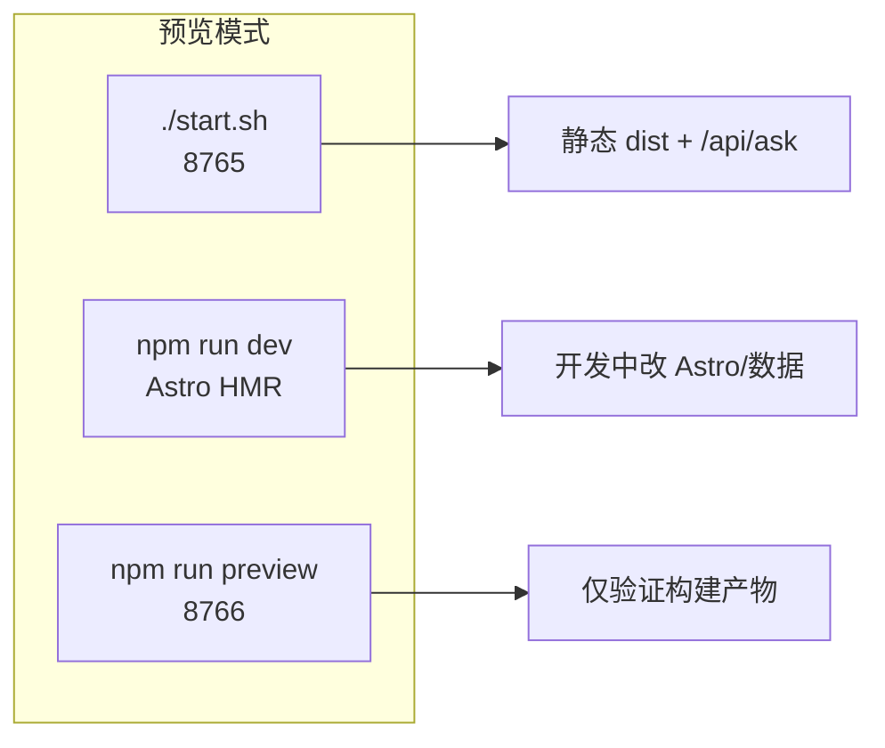

# 环境搭建与本地预览

本文是开发文档的一部分：从零配置开发环境、启动本地预览，以及常见故障排除。开发速查见 [DEVELOPER.md](../DEVELOPER.md)。

线上站点：https://bio-apple.github.io/ai/（纯静态，无 `/api/*`）

---

## 1. 环境要求

| 组件        | 推荐版本               | 依据                                         | 用途                              |
| ----------- | ---------------------- | -------------------------------------------- | --------------------------------- |
| **Node.js** | **22.x**（LTS）        | `.nvmrc` → `22`；`package.json` → `>=22 <26` | Astro 构建、ESLint、Playwright    |
| **npm**     | 10+（随 Node 22 自带） | —                                            | 依赖安装与脚本                    |
| **Python**  | **3.12**               | CI `.github/workflows/ci.yml`                | 抓取脚本、校验、`/api/*` 本地预览 |
| **Git**     | 2.x                    | —                                            | 克隆与提交                        |

**操作系统**：Linux / macOS / WSL2 均已验证。Windows 原生环境建议用 WSL2。

### 1.1 安装 Node.js（推荐 nvm）

```bash
# 安装 nvm 后，在仓库根目录：
nvm install    # 读取 .nvmrc → 安装 Node 22
nvm use        # 切换至 Node 22
node -v        # 应输出 v22.x.x
npm -v
```

若使用 **fnm**：

```bash
fnm install && fnm use
```

### 1.2 安装 Python

```bash
python3 --version   # 目标：3.12.x
```

- **macOS**：`brew install python@3.12`
- **Ubuntu/Debian**：`sudo apt install python3.12 python3.12-venv`
- 多版本并存时，可指定：`PYTHON=python3.12 ./start.sh`

项目依赖 **无需全局 pip install**；`./start.sh` 会自动创建 `.venv` 并安装 `requirements.txt`。

---

## 2. 首次搭建（完整流程）

```bash
git clone https://github.com/bio-apple/ai.git
cd ai

# 1. Node 版本
nvm use          # 或 fnm use

# 2. Node 依赖（必须用 ci，与 lock 文件一致）
npm ci

# 3. Python 虚拟环境 + 依赖（start.sh 也会自动执行，此处可选手动预热）
python3 -m venv .venv
.venv/bin/pip install -r requirements.txt

# 4. 可选：本地环境变量（分析 ID、GitHub Token 等，勿提交）
cp .env.local.example .env.local

# 5. 构建静态站
./build.sh       # 等价于 npm run build → 产出 dist/

# 6. 启动本地预览（FastAPI + 静态 dist）
./start.sh
```

浏览器打开：**http://127.0.0.1:8765/ai/**

> 根路径 `http://127.0.0.1:8765/` 会自动重定向到 `/ai/`，与 GitHub Pages 的 `base: /ai/` 一致。

### 2.1 验证环境是否正常

```bash
# 代码规范
npm run quality

# 与 CI 对齐的全量校验（需先 build）
npm run build
DIST=dist python3 scripts/validate_ci.py

# 单元测试
npm run test:unit

# E2E（会自动起 8766 端口静态服）
npm run test:e2e
```

---

## 3. 本地预览的三种模式

根据你的目的选择不同方式：



| 模式                 | 命令                               | 地址                          | 适用场景                               |
| -------------------- | ---------------------------------- | ----------------------------- | -------------------------------------- |
| **完整预览（推荐）** | `./build.sh && ./start.sh`         | http://127.0.0.1:8765/ai/     | 与线上一致；知识库可探测 `/api/health` |
| **Astro 开发服**     | `npm run dev`                      | 终端输出的地址（通常 `4321`） | 改 `src/` 页面时热更新                 |
| **纯静态预览**       | `npm run build && npm run preview` | http://127.0.0.1:8766/ai/     | 不启 Python；无 `/api/*`               |

### 3.1 `./start.sh` 做了什么？

1. 若不存在则创建 `.venv/`
2. `pip install -r requirements.txt`（在 venv 内）
3. 检查 `dist/index.html` 存在（否则提示先 `./build.sh`）
4. 启动 `uvicorn backend.main:app`，挂载 `dist/` 到 `/ai/`，并提供 `/api/health`、`/api/ask`

配置来源：`config.yaml`（默认 `127.0.0.1:8765`）。  
可用环境变量覆盖：

```bash
PORT=8770 HOST=127.0.0.1 ./start.sh
```

### 3.2 频道 JSON 空白？

新闻 / 视频 / 课程 Tab 在运行时 `fetch` 根目录 JSON。若刚跑完抓取脚本但页面仍空：

```bash
python3 scripts/fetch_ai_news.py      # 产出 ai-news.json
python3 scripts/fetch_ai_courses.py    # 产出 ai-courses.json
npm run build                          # prebuild 会同步到 public/ → dist/
./start.sh
```

或手动同步后重建：

```bash
cp ai-news.json ai-courses.json daily-videos.json public/
npm run build
```

### 3.3 YouTube 视频抓取（本地 / CI）

每日视频依赖 `scripts/fetch_daily_videos.py`。B 站通常正常；**YouTube 在数据中心 IP 上常被反爬**，需按下列步骤配置：

**一次性配置（推荐）**

1. 打开 [Google Cloud Console](https://console.cloud.google.com/) → 启用 **YouTube Data API v3** → 创建 **API Key**
2. 本地：`cp .env.local.example .env.local`，填入 `YOUTUBE_API_KEY=你的Key`
3. GitHub：仓库 **Settings → Secrets and variables → Actions** → 新建 `YOUTUBE_API_KEY`
4. （可选）导出 YouTube Netscape cookies，`base64 -w0 youtube_cookies.txt` → Secret `YTDLP_COOKIES_B64`

**本地抓取**

```bash
# 加载 .env.local 后执行
set -a && source .env.local && set +a
python3 -m pip install -U "yt-dlp[default]" pyyaml
python3 scripts/fetch_daily_videos.py --force
npm run build
```

**CI 手动重抓**：Actions → [Daily AI Video Update](https://github.com/bio-apple/ai/actions/workflows/daily-videos.yml) → Run workflow → `force=true`。

未配置 API Key 时：脚本会沿用上一有货 YouTube 批次；构建时 `daily-videos.latest.json` 也会做历史回退。详见 [CONTENT-OPS.md](./CONTENT-OPS.md)。

### 3.4 停止预览服务

在运行 `./start.sh` 的终端按 `Ctrl+C`。  
若端口仍被占用，见下文 [§4.1 端口占用](#41-端口被占用)。

---

## 4. 故障排除

### 4.1 端口被占用

| 端口     | 默认用途                | 报错特征                       |
| -------- | ----------------------- | ------------------------------ |
| **8765** | `./start.sh` FastAPI    | `Address already in use`       |
| **8766** | `npm run preview` / E2E | Playwright 或 preview 启动失败 |
| **4321** | `npm run dev` Astro     | Astro 提示 port in use         |

**排查：**

```bash
# Linux / macOS：查看谁占用了 8765
ss -tlnp | grep 8765
# 或
lsof -i :8765
```

**处理：**

```bash
# 方案 A：结束占用进程（将 PID 替换为实际值）
kill <PID>

# 方案 B：换端口启动
PORT=8770 ./start.sh
# 访问 http://127.0.0.1:8770/ai/

# E2E 换端口
E2E_PORT=8771 npm run test:e2e
```

### 4.2 `npm ci` 失败

| 现象                                 | 原因                    | 解决                                                        |
| ------------------------------------ | ----------------------- | ----------------------------------------------------------- |
| `EBADENGINE` / engine not compatible | Node 版本过低           | `nvm use` 确保 Node **≥22**                                 |
| `EACCES` permission denied           | 全局目录权限            | 勿 `sudo npm`；检查 nvm 安装                                |
| `package-lock.json` 不一致           | 手动改了 `package.json` | `rm -rf node_modules && npm ci`                             |
| 网络超时                             | registry 访问慢         | `npm ci --registry=https://registry.npmmirror.com`（临时）  |
| `sharp` 安装失败                     | 缺少构建工具            | Linux: `sudo apt install build-essential`；macOS: Xcode CLT |

### 4.3 `pip install` / Python 相关

| 现象                         | 解决                                                        |
| ---------------------------- | ----------------------------------------------------------- |
| `python3: command not found` | 安装 Python 3.12 并确保在 PATH 中                           |
| `venv` 模块缺失              | Ubuntu: `sudo apt install python3.12-venv`                  |
| 依赖冲突                     | 删除重建：`rm -rf .venv && ./start.sh`                      |
| 系统 Python 与 venv 混用     | **始终**用 `.venv/bin/python` 或 `./start.sh`（脚本已处理） |

抓取脚本可选 Token（提高 GitHub API 限额）：

```bash
# 写入 .env.local 后：
set -a && source .env.local && set +a
python3 scripts/fetch_ai_news.py
```

### 4.4 构建失败

| 现象                            | 解决                                                                          |
| ------------------------------- | ----------------------------------------------------------------------------- |
| `未找到 dist/index.html`        | 先执行 `npm run build` 或 `./build.sh`                                        |
| `prebuild` 报错                 | 检查根目录 `ai-news.json` 等是否存在；可先 `python3 scripts/fetch_ai_news.py` |
| Astro 报错 `Cannot find module` | `rm -rf node_modules .astro && npm ci && npm run build`                       |
| `validate_ci.py` 失败           | 查看具体步骤：`DIST=dist python3 scripts/validate_ci.py <step>`               |

### 4.5 页面异常

| 现象                          | 可能原因                | 解决                                         |
| ----------------------------- | ----------------------- | -------------------------------------------- |
| 样式丢失 / 404 on `style.css` | 未 build 或访问路径错误 | 必须通过 `/ai/` 前缀访问；先 `npm run build` |
| 新闻/课程 Tab 空白            | JSON 未进 dist          | `npm run build`（prebuild 同步 JSON）        |
| 知识库 `/api/ask` 不可用      | 纯静态预览模式          | 使用 `./start.sh` 而非仅 `astro preview`     |
| 首页链接 404                  | 直接打开 `file://`      | 必须用 HTTP 服务（`start.sh` / `preview`）   |

### 4.6 Playwright E2E 失败

```bash
# 安装浏览器（首次）
npm run test:e2e:install

# 单独构建后重试
npm run build
npm run test:e2e

# 查看报告
npx playwright show-report
```

CI 失败时，PR 会上传 `playwright-report` artifact。

---

## 5. 端口与路径速查

| 服务              | 主机                  | 端口   | 路径前缀 | 配置文件                    |
| ----------------- | --------------------- | ------ | -------- | --------------------------- |
| FastAPI 本地预览  | `127.0.0.1`           | `8765` | `/ai/`   | `config.yaml`               |
| Astro preview     | `127.0.0.1`           | `8766` | `/ai/`   | `package.json` → `preview`  |
| E2E 静态服        | `127.0.0.1`           | `8766` | `/ai/`   | `playwright.config.js`      |
| GitHub Pages 线上 | `bio-apple.github.io` | 443    | `/ai/`   | `astro.config.mjs` → `base` |

**切记**：站内资源均以 `/ai/` 为 base。本地不要用 `http://127.0.0.1:8765/index.html`（会 404），应使用 `http://127.0.0.1:8765/ai/` 或 `.../ai/index.html`。

---

## 6. 日常开发工作流

```bash
# 改 Astro 页面 / 组件
npm run dev

# 改 data/*.json 或 css/*.js 后看效果
npm run build && ./start.sh

# 改 data/ 后提交前
npm run quality
npm run build
DIST=dist python3 scripts/validate_ci.py
npm run test:unit
```

---

## 7. 本地全量更新与上线前自检

从远端拉齐代码并刷新全部可抓取内容后，再构建校验、推送到云端：

```bash
git pull origin main
nvm use
npm ci
python3 -m venv .venv 2>/dev/null || true
.venv/bin/pip install -r requirements.txt

# 可选：加载 .env.local（GITHUB_TOKEN / YOUTUBE_API_KEY 等）
set -a && [ -f .env.local ] && source .env.local; set +a

# 刷新动态数据（按需；无 Token 时部分步骤可能降级/保留旧 JSON）
python3 scripts/fetch_ai_news.py
python3 scripts/fetch_daily_videos.py
python3 scripts/fetch_ai_courses.py
python3 scripts/fetch_rankings.py   # 00:00 日更；本地可手动补跑

npm run quality
npm run scan:secrets
npm run build
DIST=dist python3 scripts/validate_ci.py
npm run test:unit
# npm run test:e2e                  # 与 CI 对齐时建议跑
# lychee --config .lychee.toml './dist/**/*.html' './data/**/*.json'

git status   # 确认仅意图提交的 JSON/文档变更
git add -A   # 或按需 add；勿提交 .env.local / video-thumbs 临时脏文件（若未打算更新）
git commit -m "docs: 同步文档与本地数据刷新"
git push -u origin main
```

推送后由 Actions 自动部署 Pages；约数分钟后刷新 https://bio-apple.github.io/ai/ 。

分步校验示例：`DIST=dist python3 scripts/validate_ci.py jsonld|opengraph|search|links`。

---

## 相关文档

- [DEVELOPER.md](../DEVELOPER.md) — 开发速查与常见改动
- [FRONTEND.md](./FRONTEND.md) — 前端能力
- [ARCHITECTURE.md](./ARCHITECTURE.md) — 系统架构
- [SECURITY.md](./SECURITY.md) — `.env.local` 与安全规范
- [CI-CD.md](./CI-CD.md) — 推送与自动部署
- [CONTENT-OPS.md](./CONTENT-OPS.md) — 抓取与运营
